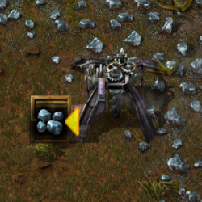
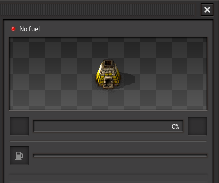
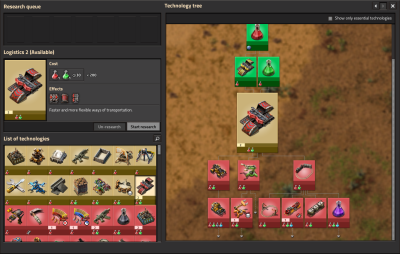
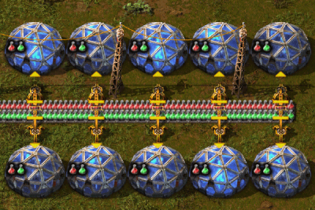
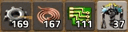

{/* _class: impact */}

# Factorio: Engineering Addiction

Week 1 — Early-Game Foundations

---

## Before you touch a belt

Read the map first. Rock formations ("big rocks") aren't ore — hand-mining
one gives free stone, and sometimes coal, in a couple of swings. That's
faster than waiting on a drill for the stone your first furnaces need, and
it can hand you enough coal to bootstrap the loop on the next slide.

- big rocks: free stone, occasional coal, no drill required
- ore patches (iron, copper, coal) are what you put drills on
- nothing here needs automation yet

---

## Mining rates

Every drill's output is fixed by two numbers: its mining speed and the
ore's own mining time. Production rate is mining speed ÷ mining time — a
faster drill or a softer ore both raise it.

- **burner mining drill**: 0.25 mining speed, 150 kW burned as fuel (not
  drawn from the grid), 2×2 footprint, 12 pollution/min
- **electric mining drill**: 0.5 mining speed — twice the burner drill —
  90 kW from the grid, 3×3 footprint with 5×5 resource coverage, 10
  pollution/min

---

## Mining rates, continued

- ore patches are finite: every successful mining action has a 100% chance
  to remove one unit from the patch, so a patch's size is also its
  lifespan, not just its yield
- hand-mining follows the same shape — (1 + mining speed bonus) × 0.5 ÷
  mining time — it's slower than a drill, but never automation-gated

---

## Mining rates, in practice



*Source: Factorio Wiki, CC BY-NC-SA 3.0.*

Same drop-straight-into-whatever's-there mechanic the next two slides use
— a chest here, a drill's fuel tank or a furnace next.

---

## Hand-mining, in practice


*Source: Factorio Wiki, CC BY-NC-SA 3.0.*

This bar is the hand-mining formula from last slide made visible — mining
speed bonuses (from research or equipment) are what speed it up.

---

## Burner chains

A mining drill deposits its output directly into whatever's immediately in
front of it — a chest, a furnace, or another burner-fuelled entity,
including a second burner mining drill.

Put two burner mining drills on a coal patch facing each other, one tile
apart: each one's output lands straight in the other's fuel tank. Prime
both by hand and the loop is self-sustaining — no inserter, no belt, no
power pole.

- fuel stacks climb past what either drill needs — that surplus is your
  coal stockpile, ctrl-click either drill to collect it
- **don't** add a burner inserter to "skim" the surplus — it pulls from the
  same fuel stack the drill runs on and can drain it faster than mining
  refills it, stalling the loop

---

## Burner chains, in practice


*Source: Factorio Wiki, CC BY-NC-SA 3.0.*

Coal just happens to also be valid fuel for what it's dropped into — the
next slide uses the same drop-into-whatever's-in-front mechanic for ore.

---

## Direct burner-to-furnace

Same mechanic, aimed at a furnace instead of another drill: place a stone
furnace directly in front of a burner mining drill's output and the drill
deposits ore straight into it. No belt, no inserter, no wasted tile.

- only the one furnace directly in front of the drill's output gets fed
  this way — everything else still needs a belt or inserter
- the drill and the furnace each still burn their own coal — hand-feed both
- pairs naturally with a burner-chain coal loop nearby: mine the coal by
  hand from the loop, carry it to the drill and furnace

---

## Direct burner-to-furnace, in practice


*Source: Factorio Wiki, CC BY-NC-SA 3.0.*

Combine this with the furnace-row idea below once you outgrow one drill,
one furnace.

---

## The ore-to-furnace ratio

One mining drill feeds a fixed number of furnaces before the belt runs
empty. Furnace *rows* beat scattered furnaces, because every furnace in a
row is in inserter reach of the same ore and coal belts.

- every furnace holds three internal item stacks: fuel, input (ore) and
  output (plates). Stone and steel furnaces have all three; the electric
  furnace has no fuel stack at all, since it draws power instead of
  burning coal
- that's why an electric furnace only needs two belt connections (ore in,
  plates out) where a burner furnace needs three (ore, coal, plates)

Stone furnace now. Steel furnace once you have the steel to spare — faster
smelt time, same footprint.

---

## Furnaces, in practice



*Source: Factorio Wiki, CC BY-NC-SA 3.0.*

An idle furnace with visible ore in it almost always means an empty fuel
stack, not an empty input — check fuel first.

---

## Boiler and steam power

Actual electricity starts with three parts in a line: an offshore pump, a
boiler, and a steam engine.

- offshore pump draws water, piped into the boiler
- boiler burns coal to turn that water into steam
- steam engine converts steam into power for the grid
- one boiler comfortably keeps two steam engines fed — build in that pair,
  not one-for-one
- that ratio scales directly: one offshore pump supplies enough water for
  20 boilers and 40 steam engines — the same 1:2 pair, sized up for a
  whole base instead of a first taste of power

---

## Boiler and steam power, in practice


*Source: Factorio Wiki, CC BY-NC-SA 3.0.*

Get this running before your first burner chain runs out of patience — it's
what everything from Week 2 onward is built on top of.

---

## Research costs something concrete

A technology's cost is a fixed count of science packs, consumed once
enough lab time has processed them — nothing about early research is
free just because no assembler is running yet.

- **Automation** costs 10 automation science packs — craftable by hand or
  by a hand-fed assembler this early — and isn't affected by the game's
  tech-price-multiplier setting the way later techs are
- Automation unlocks Assembling Machine 1 and the long-handed inserter —
  the two entities every following week assumes you already have
- a **lab** draws 60 kW, occupies a 3×3 footprint, and processes packs at
  a base speed multiplier of 1 — before any research-speed bonus exists,
  more labs working the same technology is the only way to go faster

---

## The research-time formula

Research time follows one formula: T = (T0 × P) ÷ (L × S) — per-unit time,
times price in packs, divided by labs times lab speed. Every
research-speed upgrade later in the game is really just raising L or S in
this same equation.

- only one technology is actively researched per force at a time — queuing
  several doesn't parallelise them, it just orders which one starts next
- the research queue itself has been on by default for new games since
  version 1.1.92 — queue Automation now and whatever's next starts the
  moment the packs are in, with no need to babysit the switch

---

## Research, in practice



*Source: Factorio Wiki, CC BY-NC-SA 3.0.*

Everything on this tree costs a specific number of specific packs — there
is no separate, vaguer "research points" currency underneath it.

---

## Labs, in practice



*Source: Factorio Wiki, CC BY-NC-SA 3.0.*

This is L in the research-time formula made physical — five labs here
divide the same research time by five, not by one.

---

{/* _class: quote */}

> Automation before almost everything else.

Research priority in one sentence. A couple of early logistics or
efficiency techs are worth taking first — nothing else is.

---

## Hand-fed, on purpose

Your inventory is a temporary buffer between "gathered" and "used," not a
production line.

- craft ammo and a handful of assemblers by hand while the base is small
- everything else waits for a proper line
- knowing which is which is the actual skill this week teaches

---

## What hand-crafting can't do

Hand-crafting covers most early recipes, but not all of them — knowing
the exceptions now saves a confused trip to the wiki later.

- ores can only be smelted in a furnace, never crafted by hand
- any recipe with a fluid ingredient needs a machine — no fluids in a
  hand-craft, ever
- engine units specifically must be built in an assembling machine, even
  though every one of their ingredients is solid
- left click queues one, right click queues five, shift-click queues as
  many as your inventory can support — cancelling a queued craft fully
  refunds whatever was spent on it

---

## Hand-crafting, in practice



*Source: Factorio Wiki, CC BY-NC-SA 3.0.*

Queuing a craft that needs an intermediate you don't have queues the
intermediate first, automatically — the one place a player can chain-craft
like this. Assembling machines never do it for you.

---

## Hand-fed assembling machines

An Assembling Machine 1 is available from the start — no research needed. It
costs 9 iron plates, 5 iron gear wheels, and 3 electronic circuits to build,
and needs electricity to run.

- crafting speed is 0.5 — slower per item than hand-crafting at speed 1.0
- no fluid input at this tier — a fluid ingredient waits for Assembling
  Machine 2
- the payoff isn't speed: feed it by hand, then walk away — it keeps
  working while hand-crafting ties you up for every item
- worth a steady trickle of anything before belts and inserters exist to
  automate the feed

---

## Hand-fed assembling machines, in practice


*Source: Factorio Wiki, CC BY-NC-SA 3.0.*

Automating the feed — belts and inserters into this same machine — is where
Week 2 begins.

---

{/* _class: banner */}

## Design for the base you don't have yet

Leave empty space. Leave belt-lane capacity you don't need today.

This is the one habit that separates a base that scales from one that
doesn't — and it's where Week 2 picks up.

---

## This week's practical

```txt
Goal: research Automation
Using: hand mining, manual smelting, starter power
Not using: belts or assemblers beyond what Automation unlocks
```

Bring the save you finish this tutorial with to Week 2 — base design starts
from wherever you leave it.
