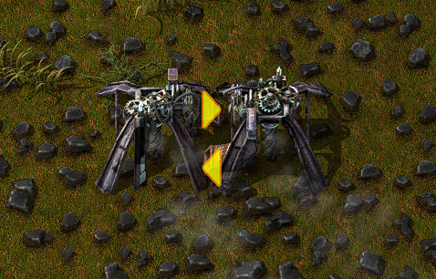
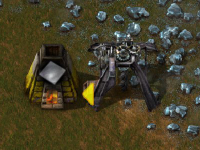
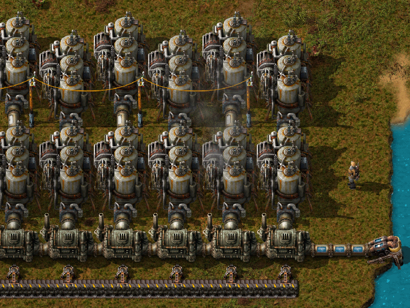
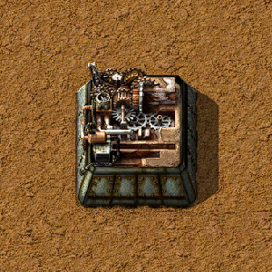

{/* _class: impact */}

# Factorio: Engineering Addiction

Week 1 — Early-Game Foundations

---

## Before you touch a belt

Read the map first. Rock formations ("big rocks") aren't ore — hand-mining
one gives free stone, and sometimes coal, in a couple of swings. That's
faster than waiting on a drill for the stone your first furnaces need, and
it can hand you enough coal to bootstrap the loop on the next slide.

- big rocks: free stone, occasional coal, no drill required
- ore patches (iron, copper, coal) are what you put drills on
- nothing here needs automation yet

---

## Burner chains

A mining drill doesn't just drop its output on the ground — it deposits
directly into whatever's immediately in front of it: a chest, a furnace, or
another burner-fuelled entity. That includes a second burner mining drill.

Put two burner mining drills on a coal patch facing each other, one tile
apart, and each one's output lands straight in the other's fuel tank. Prime
both with a handful of coal by hand and the loop is self-sustaining — no
inserter, no belt, no power pole.

- each drill mines coal faster than it burns it, so the fuel stacks climb
  well past what either drill needs to keep running
- that surplus is your actual coal stockpile: ctrl-click either drill to
  scoop it up whenever you need to refuel something else by hand
- **don't** bolt a burner inserter onto a drill to "skim" the excess — it
  pulls from the same fuel stack the drill is running on, and it can empty
  that stack faster than mining refills it, stalling the whole loop

---

## Burner chains, in practice



*Source: Factorio Wiki, CC BY-NC-SA 3.0.*

This is the same drop-into-whatever's-in-front mechanic the next slide uses
for ore — coal just happens to also be valid fuel for what it's dropped into.

---

## Direct burner-to-furnace

Same mechanic, aimed at a furnace instead of another drill: place a stone
furnace directly in front of a burner mining drill's output and the drill
deposits ore straight into it. No belt, no inserter, no wasted tile.

- only the one furnace directly in front of the drill's output gets fed
  this way — everything else still needs a belt or inserter
- the drill and the furnace each still burn their own coal — hand-feed both
- pairs naturally with a burner-chain coal loop nearby: mine the coal by
  hand from the loop, carry it to the drill and furnace

---

## Direct burner-to-furnace, in practice



*Source: Factorio Wiki, CC BY-NC-SA 3.0.*

Combine this with the furnace-row idea below once you outgrow one drill,
one furnace.

---

## The ore-to-furnace ratio

One mining drill feeds a fixed number of furnaces before the belt runs
empty. Furnace *rows* beat scattered furnaces, because every furnace in a
row is in inserter reach of the same ore and coal belts.

Stone furnace now. Steel furnace once you have the steel to spare — faster
smelt time, same footprint.

---

## Boiler and steam power

Actual electricity starts with three parts in a line: an offshore pump, a
boiler, and a steam engine.

- offshore pump draws water, piped into the boiler
- boiler burns coal to turn that water into steam
- steam engine converts steam into power for the grid
- one boiler comfortably keeps two steam engines fed — build in that pair,
  not one-for-one

---

## Boiler and steam power, in practice



*Source: Factorio Wiki, CC BY-NC-SA 3.0.*

Get this running before your first burner chain runs out of patience — it's
what everything from Week 2 onward is built on top of.

---

{/* _class: quote */}

> Automation before almost everything else.

Research priority in one sentence. A couple of early logistics or
efficiency techs are worth taking first — nothing else is.

---

## Hand-fed, on purpose

Your inventory is a temporary buffer between "gathered" and "used," not a
production line.

- craft ammo and a handful of assemblers by hand while the base is small
- everything else waits for a proper line
- knowing which is which is the actual skill this week teaches

---

## Hand-fed assembling machines

An Assembling Machine 1 is available from the start — no research needed. It
costs 9 iron plates, 5 iron gear wheels, and 3 electronic circuits to build,
and needs electricity to run.

- crafting speed is 0.5 — slower per item than crafting the same recipe by
  hand at speed 1.0
- no fluid input at this tier — a recipe needing a fluid ingredient waits
  for Assembling Machine 2
- the payoff isn't speed: place ingredients into its input by hand, then
  walk away — it keeps working while you do something else, unlike
  hand-crafting, which ties you up for every single item
- worth it for anything you want a steady trickle of before belts and
  inserters exist to automate the feed

---

## Hand-fed assembling machines, in practice



*Source: Factorio Wiki, CC BY-NC-SA 3.0.*

Automating the feed — belts and inserters into this same machine — is where
Week 2 begins.

---

{/* _class: banner */}

## Design for the base you don't have yet

Leave empty space. Leave belt-lane capacity you don't need today.

This is the one habit that separates a base that scales from one that
doesn't — and it's where Week 2 picks up.

---

## This week's practical

```txt
Goal: research Automation
Using: hand mining, manual smelting, starter power
Not using: belts or assemblers beyond what Automation unlocks
```

Bring the save you finish this tutorial with to Week 2 — base design starts
from wherever you leave it.
