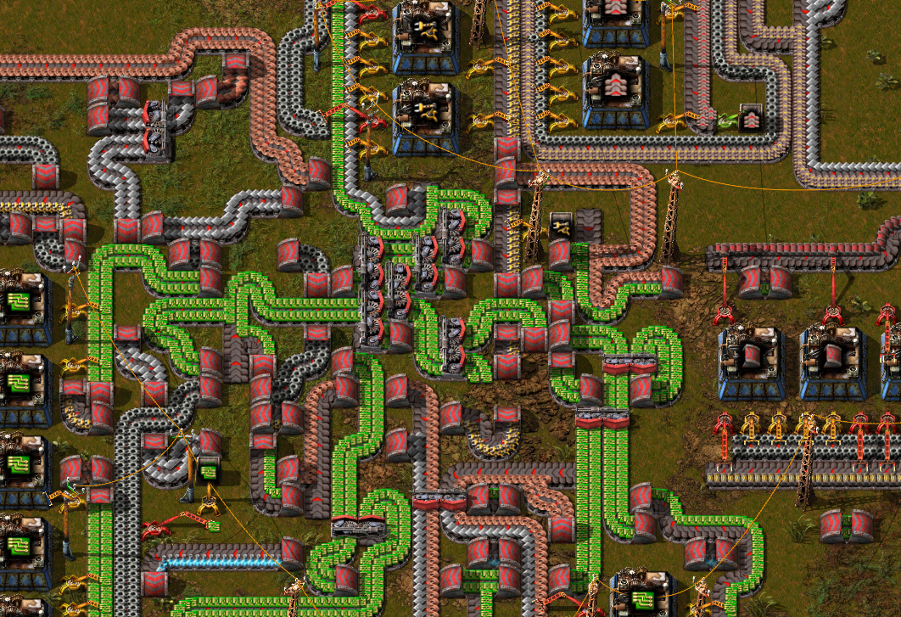
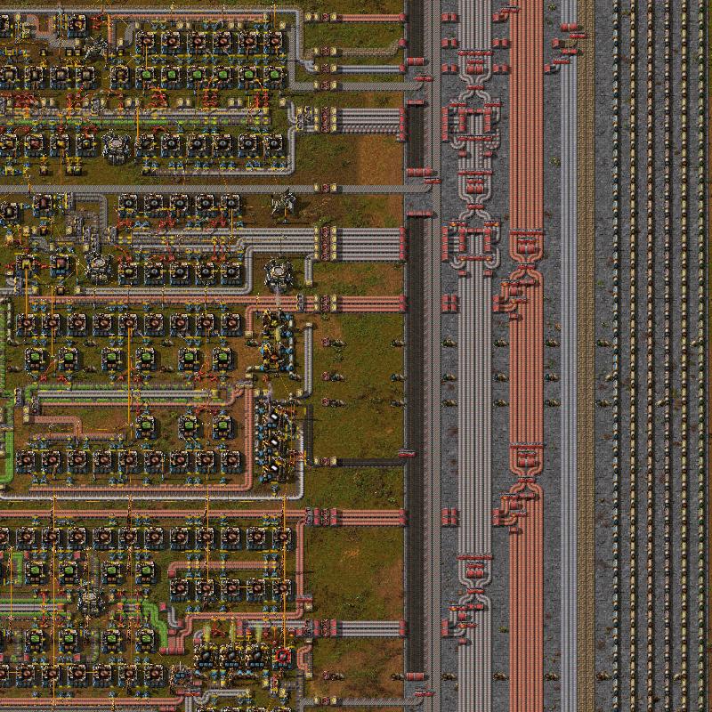
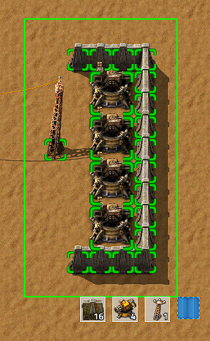
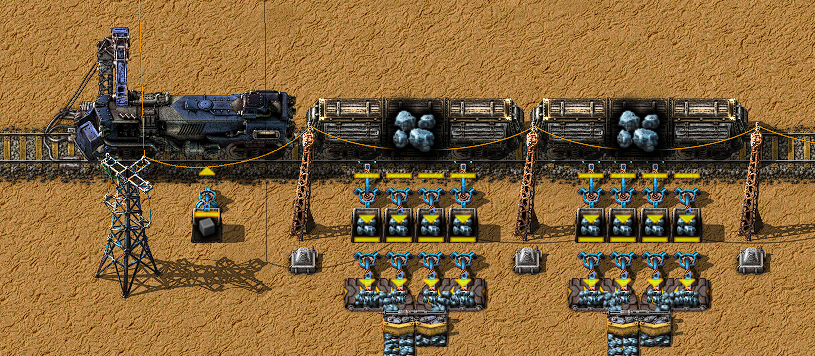

{/* _class: impact */}

# Factorio: Engineering Addiction

Week 2 — Base Design Philosophy

---

## Furnace stacks

A yellow belt runs at 15 items per second. A stone furnace takes 3.2 seconds
to smelt one ore, so it takes about 48 stone furnaces — two rows of 24, one
on each belt side — to fully consume a saturated yellow belt of ore.

- steel and electric furnaces smelt in 1.6 seconds, half the time, so half
  as many furnaces (about 24) saturate the same yellow belt
- inserters on both sides of the belt is what makes "two rows" the standard
  shape — a stack with furnaces on only one side wastes the other lane
- this ratio, not vibes, is what "how many furnaces do I need" actually
  means

---

## Footprint is a design variable

Smaller footprint means less travel and cheaper power/belt runs to build.
It also means less room to add a second furnace row later without tearing
out what's already there.

- footprint cost is paid once, at build time
- footprint benefit (or regret) is paid continuously, every time the base
  needs to grow past what was planned
- everything from here on is a different answer to that same trade-off

---

## Spaghetti

The default. No plan, no named structure — belts and pipes go wherever the
last problem needed them to go, crossing and doubling back as the base
grows around whatever was already there.

- fast to build, because there's nothing to design first
- not automatically bad at small scale — the problem is what it costs
  *later*, not what it costs now
- the specific cost: nobody, including the person who built it, can trace
  a belt by eye once enough of it exists

---

## Spaghetti, in practice



*Source: Factorio Wiki, CC BY-NC-SA 3.0.*

Everything below this slide is a way of not ending up here by accident.

---

## The bus

A small number of parallel belts, carrying the handful of intermediates
almost everything else needs — iron plates, copper plates, circuits — run
the length of the base. Production branches split material off sideways
instead of each building its own supply line from scratch.

- the fix for spaghetti's actual cost: a belt's contents and position are
  now readable on sight, because the bus's lane order doesn't change
- it's a bootstrapping tool, not the most efficient possible layout — plan
  for 2-3x the belt capacity you think you need, because widening a bus
  later means rebuilding it
- eventually outgrown: high-volume intermediates eat too many lanes, and
  distant branches pull unevenly

---

## The bus, in practice



*Source: Factorio Wiki, CC BY-NC-SA 3.0.*

Read a bus by lane, not by belt — the discipline that keeps it readable is
exactly the discipline spaghetti never had.

---

## Bot base

Logistics robots move items between named chest types instead of belts
carrying them. A provider chest is where output goes; a requester chest
is where a recipe's input gets pulled from; storage chests catch whatever
isn't currently requested.

- robots only travel where roboport coverage overlaps — two roboports
  connect their logistic ranges the same way two belts connect lanes
- trades belt-routing complexity for power draw and bot-count overhead:
  more robots doing more trips costs more power than a well-laid belt
  moving the same volume
- a careless provider chest full of the wrong thing can swamp storage
  with bots frantically moving it — provider chests want a deliberate job,
  not "somewhere to put stuff"

---

## Bot base, in practice


*Source: Factorio Wiki, CC BY-NC-SA 3.0.*

That overlapping range is the entire mechanic — no overlap, no shared
network, and a requester chest on one side can't be filled from a provider
on the other.

---

## Tileable base

A single production block, sized and shaped so it can be blueprinted once
and stamped down again identically as many times as the base needs — the
opposite of a bus's "one long readable line," this is "one small readable
block, repeated."

- expansion is copy-paste, not redesign — the block that works at 10
  copies works at 100, because each copy is self-contained
- needs a shared grid to connect to: a belt or rail spine the blocks all
  align to, or the copies don't line up
- the community shorthand for this at full scale is "city blocks" —
  uniform blocks, commonly on the order of tens of tiles square, tiled
  across the whole base

---

## Tileable base, in practice



*Source: Factorio Wiki, CC BY-NC-SA 3.0.*

The green outline is the actual unit of design here — not the individual
machine, and not the whole base, just this one repeatable block.

---

## Train base and megabases

Once one main bus can't carry the volume a base needs, trains take over as
the backbone between distant production areas and outposts — bulk cargo
instead of belt lanes.

- scales close to indefinitely once station and junction design is solid,
  but front-loads complexity into signalling, train limits, and stacker
  capacity that a bus never had to think about
- "megabase" has no official definition, but the community's rough
  benchmark is a base sustaining around 1,000 science packs a minute —
  past the point any single bus or bot network can keep up unassisted
- most megabases combine all of the above: tileable blocks for production,
  trains between them, bots for local delivery inside each block

---

## Train base, in practice



*Source: Factorio Wiki, CC BY-NC-SA 3.0.*

This one station is the same idea as the bus's "one branch" or the tileable
block's "one copy" — the repeatable unit, just moved onto rails.

---

{/* _class: quote */}

> The base doesn't need a name. The trade-off it made does.

None of spaghetti, bus, bot, tileable, or train is "correct" — each answers
the footprint trade-off differently, and most real bases mix more than one.

---

## This week's practical

```txt
Goal: compare two supplied bases — one spaghetti, one bus
Measure: actual throughput, and whether a fault can be traced by eye
Write up: which design coped better, and why
```

Keep the write-up. Assignment 1 asks you to diagnose a base under the same
lens.
