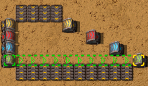
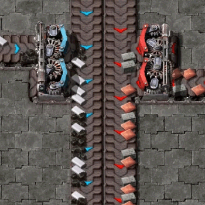
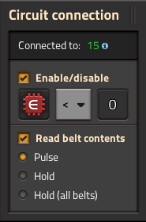
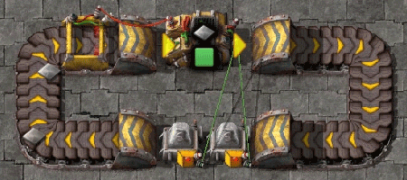

{/* _class: impact */}

# Factorio: Engineering Addiction

Week 3 — Logistics I

---

## Splitters

A splitter takes up to two input belts and up to two output belts and, by
default, spreads items across the outputs 1:1. It's the first of two
components every balancer in this lecture gets built from.

- unfiltered, a splitter alternates which output gets the next item of each
  item type — it doesn't look at lanes to do this, it tracks each item type
  independently
- set a filter and the even split stops being true at all: the filtered
  item goes entirely to its side, and the other side gets everything that
  isn't the filtered item
- priority (when set) only decides who gets first claim on leftover
  throughput — it does nothing to items already covered by a filter

---

## Underground belts

An underground belt pair crosses another belt, a pipe, or open space without
a physical intersection — the belt goes underground at one end and surfaces
at the other, with nothing to interact with in between.

- basic (yellow) underground belts span a maximum gap of 4 tiles
- fast (red) stretches that to 6, express (blue) to 8 — each tier gains 2
  tiles of range on top of the last
- exceeding the tier's maximum gap breaks the pair — they stop linking, and
  the entrance just holds

---

## Belt throughput

Speed and density together decide how much a belt can actually carry —
"throughput" is just their product, and each belt tier only moves the
number.

- belt speed is 1.875, 3.75 and 5.625 tiles/second for basic (yellow),
  fast (red) and express (blue) respectively — each tier moving exactly
  twice as fast as the last, then half again
- every belt holds up to 8 items per tile at full density, so max
  throughput is 15, 30 and 45 items/second for the same three tiers
- an underground belt pair stores whatever's in transit between its two
  ends: at its maximum 4-tile gap a basic pair holds up to 44 items,
  an express pair at its maximum 8-tile gap holds up to 72 — that stored
  buffer is invisible until the entrance is blocked and it starts backing
  up

---

## Underground belt tiers, in practice



*Source: Factorio Wiki, CC BY-NC-SA 3.0.*

The gap grows by 2 tiles per tier, but the buffer inside it grows faster
than that — a longer, faster-moving belt segment holds more items in
transit at once.

---

## Belt sides

Every belt carries two independent lanes, left and right, that can hold two
completely different items side by side without mixing. A splitter respects
this: whichever lane an item entered on, it leaves on the same lane — a
splitter changes which *belt* an item goes to, never which *lane* of that
belt it's on.

- this is why one lane of a belt can visibly clog while the other keeps
  flowing — a splitter downstream can't touch the stuck lane to relieve it
- getting two items onto one belt, one per lane, is easy; splitting them
  back apart *cleanly*, each into its own single-item belt, needs one
  splitter per item and produces one full belt per item, not half a belt each
- splitters alone can never fix an uneven lane — moving an item off its lane
  needs a different kind of connection, covered next

---

## T-junctions

Run a belt into the *side* of another belt instead of through a splitter and
you get a T-junction. Both lanes of the merging belt collapse onto a single
lane of the belt it joins — a merge from the left lands entirely on the
target's left lane, a merge from the right lands entirely on the right.

- this is the move a splitter can't make: a T-junction crosses lane content
  across the merging belt's own left/right divide, feeding both into one
  lane on the other side
- combine it with a splitter (relocates whole belts freely, never touches
  lane identity) and the two together can put any input's content on any
  output's lane — a splitter-only network never can
- merging onto a belt that's already full doesn't split evenly: only the
  upstream lane gets through, the far lane backs up behind it

---

## T-junctions, in practice



*Source: Factorio Wiki, CC BY-NC-SA 3.0.*

Neither side's supply ever reaches the other lane — that one-sided landing is
the entire mechanic, and the entire reason it's useful.

---

## Inserters and belt sides

An inserter's pickup and drop-off lane both depend on its rotation
relative to the belt it's working, not on where it stands.

- **drop-off**: facing a perpendicular belt, it places on the far lane;
  facing a parallel belt, the right-hand lane
- **pickup**: on a perpendicular belt it prefers the near lane, the
  faster grab; on a parallel belt the left-hand lane
- curved sections add exceptions to both rules — treat these as the
  general case, not a guarantee
- rotating an inserter, or changing the belt behind it, can silently
  move which lane it reads or writes — a line starving one lane after a
  layout tweak is usually this

---

## Inserters and belt sides, in practice


*Source: Factorio Wiki, CC BY-NC-SA 3.0.*

Every arrow here is the same rule applied at a different angle — worth
tracing by hand once rather than memorising as a table.

---

## Belts on the circuit network

A belt can report what's on it to a circuit network — the connection this
week's balancer theory has been silently assuming doesn't exist yet.

- **Enable/disable**: gate the belt itself on a condition — the belt
  stops moving items when the condition isn't met, same idea as gating
  an inserter
- **read belt contents**, in one of two modes: **Pulse** sends a signal
  for exactly 1 tick the moment an item enters the belt (a count of
  events), **Hold** sends the signal continuously for as long as
  matching items remain on the belt (a count of what's currently there)
- a third variant of Hold mode reads the *entire* connected belt line,
  counting through underground belts but not across a splitter or a
  sideloaded belt — connectivity for this purpose isn't the same as
  connectivity for items

---

## Belts on the circuit network, in practice



*Source: Factorio Wiki, CC BY-NC-SA 3.0.*

---

## A worked example



*Source: Factorio Wiki, CC BY-NC-SA 3.0.*

This is Hold mode read directly into a combinator condition — the
combinator's output changes exactly when the watched item is physically
present on the belt, and reverts the instant it isn't.

---

## Buffers

A buffer — a chest, or just a length of belt used as rolling storage — absorbs
the gap between a process that produces in bursts and one that consumes at a
steady rate, or the reverse.

- a buffer doesn't fix a throughput mismatch, it only delays when the
  mismatch becomes visible
- sized too small, it empties or fills before the spike ends and the
  mismatch shows up anyway
- useful wherever a machine's rhythm doesn't match its neighbour's — a
  batch process feeding a continuous one is the common case

---

## Balancers

A balancer is expected to balance both belts and lanes — every output belt
gets an even share of the input, *and* both lanes of every belt in the
network stay even too. Model the network as a graph: splitters and
T-junctions are nodes, belts connecting them are edges. Splitters move whole
belts of content around and always split it evenly, but never cross a lane;
T-junctions cross lanes, but only by collapsing a belt onto one lane of
whatever it joins. A real balancer's graph needs both node types — a
splitter-only graph can balance every belt and still be carrying a lopsided
left/right split the whole time, because nothing in it was ever able to fix
one.

- a balancer is **throughput-unlimited** only if it meets both: 100%
  throughput when every input and output is in use, *and* any subset of
  inputs can still fully supply any subset of outputs — most hand-built
  arrangements satisfy the first and quietly fail the second

---

## The 4-to-4 balancer

The standard 4-to-4 balancer is the textbook case for the throughput
condition: a splitter-only graph model says 4 splitters are enough, and
they are, for full load. But with only some inputs and outputs active, two
of the four outputs turn out fed by only one splitter each — capped at one
belt's worth between them even though two full belts feed that splitter.

- the fix adds two more splitters purely to remove that internal
  chokepoint — 6 splitters, not 4, for a 4-to-4 balancer that's actually
  throughput-unlimited; the general formula for larger power-of-2 sizes is
  n·log₂(n) − n/2 splitters
- that formula counts splitters, not T-junctions — it answers "does every
  belt get an even share," a separate question from "does every lane," and
  a design only earns the name "balancer" once both are true

---

## Balancer graph, in practice


*Source: Factorio Wiki, CC BY-NC-SA 3.0.*

Read the labels top to bottom — that's the splitter half of the graph made
visible, one splitter mixing two inputs at a time until every output carries
a share of all four. A real build still needs T-junctions worked into this
same structure to answer for the lanes.

---

{/* _class: quote */}

> A balancer that only works when every belt is full isn't balanced. It's
> lucky.

The whole point of the throughput-unlimited condition is that luck isn't a
design.

---

## This week's practical

```txt
Goal: 5-belt-to-4-belt balancer, splitters and underground belts only
Test: starve one input lane at a time
Pass: all four outputs stay even regardless of which input is starved
```

A balancer that passes with all five inputs full and fails with one starved
looks identical to a working one until you actually test it — test it.
