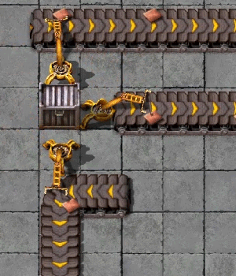
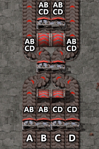

{/* _class: impact */}

# Factorio: Engineering Addiction

Week 3 — Logistics I

---

## Splitters

A splitter takes up to two input belts and up to two output belts and, by
default, spreads items across the outputs 1:1. Every balancer in this
lecture is built out of nothing but this one component, wired together
differently.

- unfiltered, a splitter alternates which output gets the next item of each
  item type — it doesn't look at lanes to do this, it tracks each item type
  independently
- set a filter and the even split stops being true at all: the filtered
  item goes entirely to its side, and the other side gets everything that
  isn't the filtered item
- priority (when set) only decides who gets first claim on leftover
  throughput — it does nothing to items already covered by a filter

---

## Underground belts

An underground belt pair crosses another belt, a pipe, or open space without
a physical intersection — the belt goes underground at one end and surfaces
at the other, with nothing to interact with in between.

- basic (yellow) underground belts span a maximum gap of 4 tiles
- fast (red) stretches that to 6, express (blue) to 8 — each tier gains 2
  tiles of range on top of the last
- exceeding the tier's maximum gap breaks the pair — they stop linking, and
  the entrance just holds

---

## Belt sides

Every belt carries two independent lanes, left and right, that can hold two
completely different items side by side without mixing. A splitter respects
this: whichever lane an item entered on, it leaves on the same lane — a
splitter changes which *belt* an item goes to, never which *lane* of that
belt it's on.

- this is why one lane of a belt can visibly clog while the other keeps
  flowing — a splitter downstream can't touch the stuck lane to relieve it
- getting two items onto one belt, one per lane, is easy; splitting them
  back apart *cleanly*, each into its own single-item belt, needs one
  splitter per item and produces one full belt per item, not half a belt each
- this same lane-locked behaviour is the detail that makes balancer design
  harder than "wire some splitters together" — more on that shortly

---

## Inserters and belt sides

An inserter's pickup and drop-off lane both depend on its rotation relative
to the belt it's working — not on where it happens to be standing.

- **drop-off**: facing a belt that runs perpendicular to the inserter, it
  places on the far lane; facing one that runs parallel (same or opposite
  direction), it places on the belt's right-hand lane
- **pickup**: on a perpendicular belt it prefers the near lane, because
  that's the faster grab; on a parallel or opposite-facing belt it prefers
  the left-hand lane
- curved belt sections add exceptions to both rules, and community testing
  has turned up specific direction combinations where an inserter behaves as
  if it's aware of the belt's shape, not just its own facing — treat the
  above as the general case, not an absolute guarantee
- practical consequence: rotating an inserter, or changing the belt layout
  behind it, can silently move which lane it reads from or writes to — a
  working line that starts starving one lane after a layout tweak is usually
  this, not a broken inserter

---

## Inserters and belt sides, in practice



*Source: Factorio Wiki, CC BY-NC-SA 3.0.*

Every arrow here is the same rule applied at a different angle — worth
tracing by hand once rather than memorising as a table.

---

## Buffers

A buffer — a chest, or just a length of belt used as rolling storage — absorbs
the gap between a process that produces in bursts and one that consumes at a
steady rate, or the reverse.

- a buffer doesn't fix a throughput mismatch, it only delays when the
  mismatch becomes visible
- sized too small, it empties or fills before the spike ends and the
  mismatch shows up anyway
- useful wherever a machine's rhythm doesn't match its neighbour's — a
  batch process feeding a continuous one is the common case

---

## Balancers

Model a splitter network as a graph: each splitter is a node, each belt
connecting two splitters is an edge. Because a splitter always sends an even
share of what it receives to each of its outputs, this graph is enough to
reason about where items end up — in principle.

- a balancer is **throughput-unlimited** only if it meets both: 100%
  throughput when every input and output is in use, *and* any subset of
  inputs can still fully supply any subset of outputs — most hand-built
  splitter arrangements satisfy the first and quietly fail the second
- the standard 4-to-4 balancer is the textbook case: the graph model says 4
  splitters are enough, and they are, for full load — but with only some
  inputs and outputs active, two of the four outputs turn out to be fed by
  only one splitter each, capping them at one belt's worth between them even
  though two full belts feed that splitter
- the fix adds two more splitters purely to remove that internal
  chokepoint — 6 splitters, not 4, for a 4-to-4 balancer that's actually
  throughput-unlimited; the general formula for larger power-of-2 sizes is
  n·log₂(n) − n/2 splitters
- lanes complicate this further: the graph model reasons about whole belts,
  but a splitter never moves an item between lanes — a design that looks
  balanced belt-by-belt can still be carrying an uneven left/right split the
  graph never sees

---

## Balancer graph, in practice



*Source: Factorio Wiki, CC BY-NC-SA 3.0.*

Read the labels top to bottom — that's the graph made visible, one splitter
mixing two inputs at a time until every output carries a share of all four.

---

{/* _class: quote */}

> A balancer that only works when every belt is full isn't balanced. It's
> lucky.

The whole point of the throughput-unlimited condition is that luck isn't a
design.

---

## This week's practical

```txt
Goal: 5-belt-to-4-belt balancer, splitters and underground belts only
Test: starve one input lane at a time
Pass: all four outputs stay even regardless of which input is starved
```

A balancer that passes with all five inputs full and fails with one starved
looks identical to a working one until you actually test it — test it.
