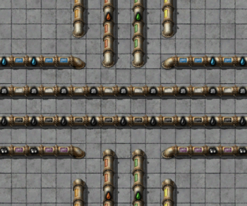
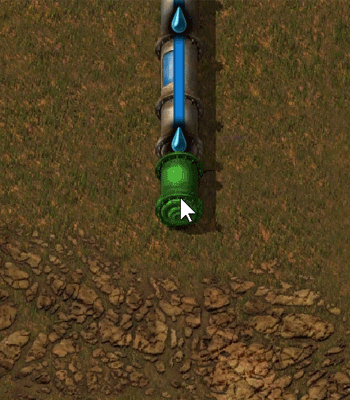
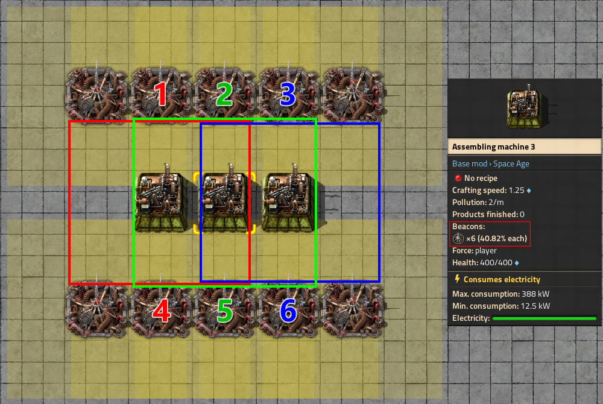

{/* _class: impact */}

# Factorio: Engineering Addiction

Week 4 — Ratios and Bottlenecks

---

## Input/output ratios

Every recipe is a rate problem in disguise: a crafting time plus an
ingredient list is enough to work out exactly how many machines of each
kind a line needs, with no trial and error involved.

- a machine's output rate is `1 / crafting time` items per second, scaled by
  its crafting speed — a stone furnace smelting iron plate (3.2s at speed
  1) makes 0.3125 plates/second, an electric furnace (speed 2) makes 0.625
- to match a downstream consumer's demand, divide its consumption rate by
  the upstream machine's output rate — the result is how many machines to
  build, not a number to round down casually
- getting this from the recipe, not "add furnaces until it looks enough,"
  is what makes a ratio something you can state and defend

---

## Fluid systems

Fluids are not items on a belt. A pipe (or a connected run of pipes and
tanks) holds fluid as one continuous, shared quantity — not discrete units
occupying slots.

- a connected run of pipes not broken by a pump is a single "segment": the
  fluid level equalises across the whole segment as pressure, not as
  individual units queuing
- each connection point (a machine or pump) is capped at a theoretical
  maximum of 6000 fluid/second (100/tick); in practice this settles around
  4200 fluid/second per connection — a machine with two output sockets for
  the same fluid effectively doubles that, to ~8400/second

---

## Fluid pressure and distance limits

- flow speed depends on how full the segment already is — nearly empty
  fills fast but drains slowly, nearly full is the reverse; 12,550 units
  into a 25,000-unit tank via one 100-unit pipe settles at 12,500 in the
  tank and 50 in the pipe, both at the same 50% of capacity, not the same
  absolute amount
- pumps aren't just for speed — they split one long segment into several;
  an unpumped run stops equalising past 320×320 tiles (10×10 chunks), a
  hard distance limit regardless of pipe count
- a machine with both an input and output socket for the same fluid (e.g.
  an electric mining drill over uranium ore, drawing sulfuric acid) drains
  fluid for its own recipe first — once its input is full, the extra
  sockets behave like an ordinary pipe equalising with its neighbours

---

## Fluid systems, in practice



*Source: Factorio Wiki, CC BY-NC-SA 3.0.*

Each pipe here is one fluid at one shared level — there's no belt-style gap
between one unit and the next.

---

## Pipe distance limits, in practice



*Source: Factorio Wiki, CC BY-NC-SA 3.0.*

Past 320 tiles unpumped, the far end of this run simply stops
participating in the shared level — a pump doesn't just speed the run up,
it's what makes the far end part of the same segment at all.

---

## Crude oil to petroleum gas

Basic oil processing turns crude oil into petroleum gas, light oil and
heavy oil in fixed proportions — useful early, but it leaves you with
heavy and light oil you may not need yet.

- advanced oil processing (adds water) shifts the mix and adds
  cracking: a chemical plant cracks heavy oil into light, and light
  into petroleum gas, on a surplus of the heavier fluid
- the oft-quoted ratio for pure petroleum gas is 20 refineries : 5
  heavy-cracking : 17 light-cracking (8:2:7 close enough) — assuming
  none of the heavy or light oil is wanted elsewhere
- once lubricant or rocket/solid fuel matter, a fixed ratio over-cracks
  — most factories gate cracking on actual surplus instead

---

## Modules

Modules are a ratio decision before they're a power-cost one — each type
trades a different set of stats, and the trade only pays off if the recipe
and the machine's role can absorb it.

- **speed modules**: +20% / +30% / +50% crafting speed by tier, at a cost of
  +50% / +60% / +70% energy consumption — pure throughput, no output bonus
- **productivity modules**: +4% / +6% / +10% extra output for free by tier,
  at a cost of +40–80% energy *and* −5% to −15% crafting speed — only legal
  on recipes that produce intermediate products, not on every recipe
- **efficiency modules**: −30% / −40% / −50% energy consumption, tier for
  tier, with no speed or output change at all

---

## Module stacking limits

Stacking modules of the same type doesn't scale forever — both speed's
energy cost and efficiency's savings hit a hard floor before the slots
run out.

- energy consumption from module stacking can't be pushed below 20% of a
  machine's unmodified base value, no matter how many speed or efficiency
  modules are involved
- efficiency modules cap total consumption reduction at −80% — three
  already gets close: an electric mining drill's normal 10 pollution/min
  drops to 2 (an 80% cut) with three basic efficiency modules
- an electric furnace draws 180 kW unmodified; one basic efficiency
  module alone cuts that by 54 kW (−30%) — close to a solar panel's worth
  of demand, from one module slot

---

## Productivity module exceptions

Productivity's free-output bonus is powerful enough that the game
explicitly excludes it from a short list of recipes, and reserves it for
where the payoff compounds.

- **productivity modules can't go in every recipe** — barrel filling,
  barrel emptying, producing barrels from steel, and steam condensation
  are all named exclusions, mostly recipes the wiki notes could otherwise
  loop resources for free
- productivity modules pay off at scale: three productivity module 3s in
  a rocket silo cut total resource cost per launch by almost 30%, saving
  roughly 26,000 copper ore per rocket

---

## Beacons

Module effects from multiple modules in the same machine add up linearly.
A beacon extends a module's effect to nearby machines without taking up
their module slots.

- a beacon covers a 9×9 tile area, holds 2 module slots, and transmits
  each module's effect at 150% distribution efficiency *per beacon* —
  before the diminishing-returns rule below, one beacon alone already
  transmits more than a straight 1:1 copy of what's in its slots
- transmitted effect scales with the square root of beacon count, not
  linearly: 1 beacon reaching a machine gives 150% total effect, 2 beacons
  give 212%, and by 20 beacons reaching one machine the total is 671% —
  but the marginal gain from that 20th beacon is only 17%, against 62%
  from the second

---

## Beacon coverage strategy

That square-root falloff is what turns beacon placement into a coverage
problem rather than a "more is better" one.

- a beacon's transmitted strength drops as more beacons reach the same
  machine — coverage shared between machines beats stacking beacons onto
  one, precisely because of that square-root falloff
- productivity modules can't be placed in beacons at all — only speed and
  efficiency modules transmit

---

## Modules and beacons, in practice



*Source: Factorio Wiki, CC BY-NC-SA 3.0.*

Read the tooltip, not just the picture — six beacons reaching one machine
transmit at a fraction of what one beacon alone would, which is why beacon
layouts are designed around sharing coverage between machines, not stacking
it onto one.

---

## On-site versus belted-in intermediates

An intermediate product — a gear, a circuit, a cable — can be made right
next to where it's consumed, or carried in on a belt from a central
production line. Neither is free.

- making it on-site avoids competing for space on a shared bus belt, but
  duplicates that production step everywhere it's needed, and duplicates
  the mistake if the local ratio is ever wrong
- belting it in from one central line means the ratio only has to be worked
  out once, but adds that intermediate to the bus's belt-count budget, and
  a bus has a limited number of belt lanes to spend
- this is the same trade-off Week 2 raised between spaghetti and the bus,
  now applied at the scale of a single intermediate rather than a whole
  base

---

## Chaining assembling machines

A ratio that balances two machines doesn't automatically balance a longer
chain — each extra step multiplies in its own crafting time and ingredient
count, and small roundings compound.

- electronic circuits need copper cable, itself a crafted intermediate (1
  copper plate → 2 copper cable, 0.5s) — under-provision the cable
  assemblers by even one machine and the circuit line never sees it
- work a chain from its *last* step backwards: fix the desired output rate,
  divide back through each step's ratio, and round every machine count up,
  not down — rounding down reintroduces the shortfall the calculation was
  meant to prevent
- a rounding shortfall at step two of five doesn't look like a step-two
  problem downstream — every later machine looks randomly starved, because
  in effect it is

---

{/* _class: quote */}

> A ratio you can state and defend beats a ratio that happens to work today.

The whole point of doing the arithmetic is that "it looked fine yesterday"
isn't a ratio.

---

## This week's practical

```txt
Goal: fully automate red or green science packs, raw ore to lab feed
Test: run the line unattended for a sustained period
Pass: no assembler sits starved or backed up, and the ratios used are
      stated, not arrived at by trial and error
```

State the ratio for every step before you build it — the build is there to
confirm the arithmetic, not to substitute for it.
