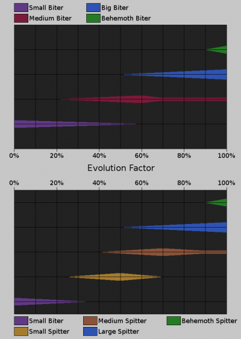
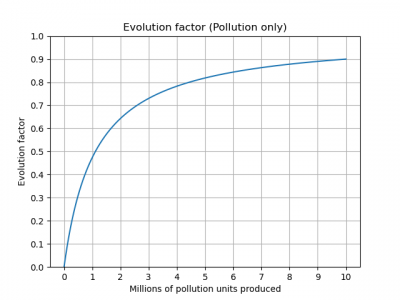
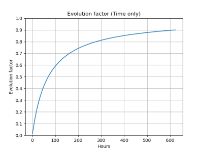
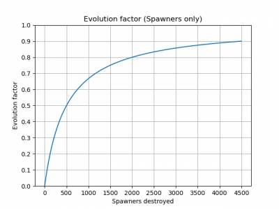
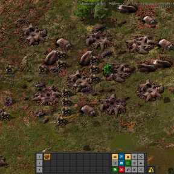
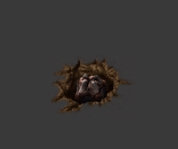
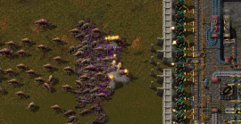
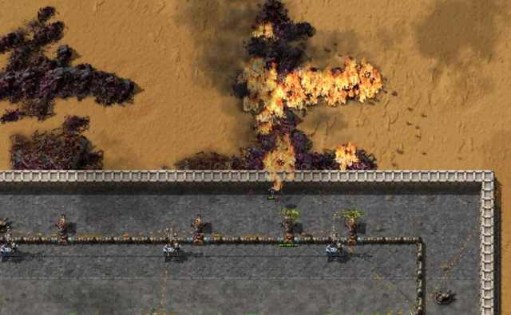

{/* _class: impact */}

# Factorio: Engineering Addiction

Week 5 — Transport and Defence

---

## Transport options

Walking is the baseline every other option is measured against — each
vehicle buys speed, cargo space, or both, at a different cost.

- the **car** trades a fuel slot for speed well above walking pace, with a
  small cargo hold — cheap and early, favoured for outrunning trouble
- the **tank** is slower and less maneuverable than walking, but carries a
  submachine gun, a flamethrower and a cannon — durability over mobility
- the **train** (next week) trades route flexibility for speed and cargo
  capacity over long, fixed distances
- the **spidertron** takes no fuel — its speed comes from exoskeleton
  equipment in its own grid, and it crosses terrain wheels can't

---

## Obstacle removal

Cliffs and water aren't obstacles to route around forever — cliff
explosives and landfill remove them permanently, at a deliberate resource
cost.

- cliff explosives clear a cliff face outright, opening a route or building
  site that was previously blocked
- landfill converts water tiles to buildable land, at the cost of the
  landfill material itself
- both are one-way: once placed, the terrain change is permanent, which
  makes it a genuine design decision, not a temporary fix

---

## Biters, worms and nests

Enemy presence grows along an **evolution factor** from 0 to 1, driven by
three independent things: time passing, cumulative pollution produced, and
nests destroyed. All of it is driven by total pollution *produced*, not by
how much of the cloud you've managed to contain.

- each source has a fixed weight per unit: time adds 0.000004/second,
  destroying a spawner adds 0.002 (same for every spawner type — not
  worms), pollution adds 0.0000009 per unit produced
- the three weighted totals are summed, then squashed into the 0-1 range
  by `evolution_factor = total / (1 + total)` — this is why evolution
  climbs fast early and crawls near 1.0, not a hand-tuned late-game curve

---

## Evolution's diminishing marginal effect

- the same action's *marginal* effect shrinks as evolution rises: any
  increase is multiplied by `(1 - evolution_factor)²`, so destroying a
  nest at evolution 0 adds the full 0.002, but the same kill at evolution
  0.5 adds only a quarter of that, 0.0005

---

## Pollution's second job, and nest expansion

Evolution isn't pollution's only effect, and nests aren't purely passive
between attacks — both run on their own separate schedules.

- pollution has a second job: pollution reaching a nest triggers actual
  attacks, on its own schedule — containing the cloud reduces attack
  frequency even though it does nothing for evolution already accrued
- nests also expand on their own timer, claiming territory outward until
  they reach an occupied area — left alone, expansion fills every explored
  area

---

## Evolution weights, in practice



*Source: Factorio Wiki, CC BY-NC-SA 3.0.*

Three independent tracks feeding one shared total — raising evolution from
any one of them raises it for all of them, since the game only ever sees
the combined number.

---

## Biters, worms and nests, in practice



*Source: Factorio Wiki, CC BY-NC-SA 3.0.*

The curve flattens, it never resets — pollution already produced doesn't
un-produce itself, which is why the practical lever is producing less of
it going forward, not cleaning up what's already out there.

---

## Reaching the same evolution factor, three ways

Any of the three sources alone can drive evolution to the same value —
the numbers below are what *each one* takes on its own, holding the other
two at zero.

```txt
evolution   pollution alone   time alone   destroyed spawners alone
   10%          123k             7.7 hrs           56
   50%         1.111M           69.4 hrs           500
   90%           10M           625.0 hrs          4,500
```

---

## Reading the three-ways table

- reaching 50% evolution from time alone takes under three days of a
  world simply existing, running or not — the clock never stops
- reaching it from spawners alone means 500 kills, at a shrinking marginal
  gain per kill the closer you get — the last hundred cost far more than
  the first hundred

---

## Evolution, in practice — by time



*Source: Factorio Wiki, CC BY-NC-SA 3.0.*

Same flattening shape as the pollution-only curve — every source feeds the
same squashing formula.

---

## Evolution, in practice — by spawners



*Source: Factorio Wiki, CC BY-NC-SA 3.0.*

Every source produces the same diminishing-returns curve — this graph and
the time-based one on the previous slide are shaped identically on
purpose.

---

## Nest expansion

Nests don't just sit still producing pollution — they claim new territory
on their own schedule.

- roughly every 60 to 4 minutes (the interval shrinks as evolution rises),
  a nest sends 5-20 units to found a new nest — the target chunk is picked
  within a 7-chunk radius by a score that only counts *how many* player
  structures and enemy spawners are nearby, never what those structures
  cost or how big they are
- that scoring is exactly why a single pipe run through open ground is an
  unusually cheap deterrent — it counts the same as a wall for suppressing
  expansion into that chunk, at a fraction of the resource cost

---

## Nest attacks

Attacks run on a second, separate schedule, triggered by pollution rather
than by a timer alone.

- once pollution reaches a nest, it musters a group and launches an attack
  roughly every 1 to 10 minutes
- if some of the mustered units haven't arrived at the rendezvous point
  yet, the attack waits up to an additional 2 minutes for stragglers
  before going anyway

---

## Biter pathing

Biters heading to attack a target take the shortest path that accounts for
terrain, but not for player-built obstacles like walls — what happens next
depends on how much detour those obstacles cost.

- if there's a clear route around an obstacle that isn't much longer, the
  group takes it and never touches the obstacle at all
- if there's no clear route around, or going around would mean a large
  detour, the group attacks whatever is blocking the direct path instead

---

## The maze tactic, and breaking off early

- this is exploitable on purpose: a maze of walls with no clean way around
  forces an attacking group through a chosen corridor, tower-defense style
  — the tactic only works because the detour-cost rule is real, not because
  biters are simply attracted to walls
- a biter that comes within range of a military structure or unit while
  travelling breaks off early and attacks that instead, using the same
  shortest-path logic against the new, closer target

---

## Turret creep

Turret creep is an offensive tactic: advance on a nest by placing turrets
just ahead of the last ones, retreating after each placement, until the
turrets are close enough to kill it.

- a gun turret's 18-tile range already beats every biter's melee reach and
  a behemoth spitter's 16-tile spit — a turret line wins that engagement
  once placed; creep exists only because turrets must be built within the
  *player's* own reach, not because they're outranged

---

## Turret creep: the worm exception

- worms are static, don't chase, but outrange the turret that's meant to
  counter them — small worms reach 25 tiles, medium 30, big 38, behemoth
  48, all well past 18. A worm gets to shoot first and keep shooting
  throughout the whole creep-in; the turret doesn't return fire until it's
  already inside the worm's range, not the other way round

---

## Turret creep: damage math

- piercing rounds do 8 damage/shot at 10 shots/second — 80 DPS per turret,
  enough to drop a freshly-spawned 350 HP spawner in under five seconds.
  The same math against a max-evolution 3,500 HP spawner takes ten times
  as long, which is the real reason creep stalls once behemoths show up:
  the spawner's health scaled with evolution, the turret's damage didn't
- the placement limit forces a run-in, place, retreat cycle — turrets can
  only be placed within reach, so the line "creeps" forward rather than
  being planned from range

---

## Turret creep, in practice



*Source: Factorio Wiki, CC BY-NC-SA 3.0.*

This is the "before": no wall, no fixed line, just a nest cluster and a
player about to place the first turret within reach of it — everything
that follows is run-in, place, retreat, repeated.

---

## Worms

Worms are static — never chasing, expanding, or leaving their spawn tile —
but everything else about them is built to punish getting close.

- worm tier is gated by evolution during expansion (map-generated worms
  ignore this): medium needs evolution ≥0.3, big ≥0.5, behemoth ≥0.9 — the
  further from the starting area, the stronger the worms map generation
  places regardless of current evolution
- range climbs sharply by tier: small 25 tiles, medium 30, big 38,
  behemoth 48 — every tier already clears the gun turret's 18-tile range
- big and behemoth worms resist up to 70% of fire damage, and behemoth
  worms resist 80% of laser damage — a flamethrower or laser line built
  for biters and spitters underperforms badly against a worm nest by
  comparison

---

## Worms, in practice



*Source: Factorio Wiki, CC BY-NC-SA 3.0.*

It never advances and never retreats — every worm engagement is decided by
whether you can close 25-48 tiles of open range before it decides you're
in range of it.

---

## Firepower and kiting

- walls only block melee contact, not projectile or spit damage — big and
  behemoth biters reach 1.5 tiles regardless of a single wall layer, and a
  spitter's 13-16 tile spit range makes a wall irrelevant to it entirely
- a spitter's acid puddle outlasts the hit that made it: every tier's
  puddle sits for 32 seconds, doing 7.2 acid/second for the small tier up
  to 360/second for the behemoth tier, and slows anything standing in it
  by 30-60% for 2 seconds per contact — the puddle, not just the
  projectile, is what makes standing still in a spitter fight expensive

---

## Kiting and laser upkeep

- kiting uses a vehicle's speed to stay outside an enemy's attack range
  while still doing damage — useful against spitters and worms, whose
  ranged damage otherwise ignores your speed
- laser turrets trade ammo logistics for power draw: no supply chain to
  feed, but 1.2 MW while firing against 24 kW idle means a laser wall
  needs power headroom sized for a real attack, not just its average draw

---

## Firepower and kiting, in practice



*Source: Factorio Wiki, CC BY-NC-SA 3.0.*

This is what a finished, static line looks like mid-attack — the wall
stops nothing on its own, every bit of stopping power is coming from the
turrets behind it.

---

## Static defences and flamethrowers

A defensive line meant to sit in one place and hold indefinitely has a
different job than turret creep's advance — and a different weapon choice
follows from it.

- flamethrower turrets deal damage in a spreading area rather than to one
  target at a time, so a mixed wave of small, medium and big biters dies
  faster per shot than the same wave against single-target gun or laser
  fire
- their fire also lingers on the ground briefly, keeping damage applied to
  anything still standing in it — a static line gets to spend that DPS on
  crowd density it doesn't have to aim

---

## Flamethrowers: trade-offs

- the trade-off is fuel logistics and range: flamethrower turrets need a
  piped fuel supply and have a minimum range, so they pair with — not
  replace — gun or laser turrets covering what's too close to burn safely
- fire is a poor answer to worms specifically: big and behemoth worms
  resist up to 70% of fire damage (see the Worms slide), so a flamethrower
  line sized for a biter wave burns through nowhere near as fast against
  a nest defended by higher-tier worms

---

## Static defences, in practice



*Source: Factorio Wiki, CC BY-NC-SA 3.0.*

The fire keeps burning ground it already touched — that lingering area
damage, not raw per-shot power, is what a static line is actually buying
with the fuel cost.

---

## Other tools

Not every threat is a straight firepower fight — poison capsules and
combat robots solve problems that turrets and guns don't.

- poison capsules deal heavy damage to worms specifically — spawners
  aren't affected by poison damage at all, so this is a worm tool, not a
  nest-clearing one — with far more range than a grenade, the direct
  answer to a worm a player can't safely walk up to
- combat robots (defender, distractor and destroyer, in rising cost order)
  follow the player or hold position and fight automatically, useful for
  soaking or distributing damage during an attack run on a nest rather than
  tanking every hit personally
- neither replaces firepower — both exist to change *where* the damage
  lands, buying survivability during an approach a straight gunfight
  wouldn't allow

---

{/* _class: quote */}

> Walling off a threat isn't clearing it. It's scheduling it for later, with interest.

Evolution keeps accruing on its own timer whether or not you're looking at
it — postponing a nest doesn't shrink the bill.

---

## This week's practical

```txt
Goal: destroy a biter nest with this week's tools, opening up access
Test: use at least one non-turret tool (vehicle, capsule, or terrain change)
Pass: the targeted nest is destroyed, not just suppressed; pollution and
      evolution state at the time of the attack is noted
```

Suppressing a nest behind a wall isn't the goal here — the nest has to
actually come down, and by a route that uses more than gun turrets alone.
