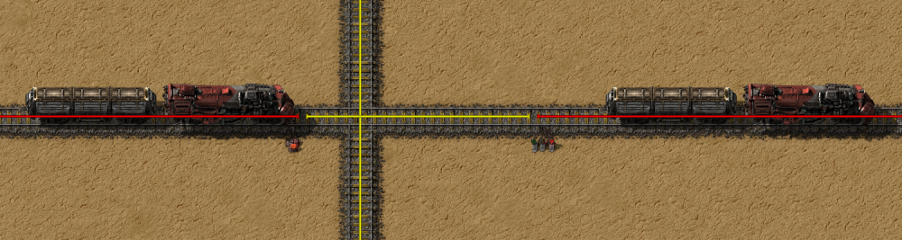

{/* _class: impact */}

# Factorio: Engineering Addiction

Week 6 — Rail Engineering

---

## Fluids on trains

Pipes have a real throughput ceiling once a fluid needs to travel far —
fluid wagons move the same fluids in bulk over a fixed route instead,
trading pipe segments for train capacity.

- a fluid wagon is filled and drained by pumps, not by the offshore pumps
  used to draw water from a body of water — different tool, same word
- moving a fluid by rail instead of pipe only pays off once the distance is
  long enough that pipe throughput (covered in Week 4) would otherwise be
  the bottleneck
- the trade is the same one belts and rail always make: rail wins on long
  fixed routes, direct connection wins at short range

---

## Trains

Two properties decide how a rail network behaves under load: acceleration,
set by locomotive count and fuel grade, and braking distance, set by the
ratio of wagons to locomotives.

- braking distance depends only on the wagon-to-locomotive ratio, not on
  overall train length — a 1-4 and a 2-8 train (same ratio) brake over the
  same distance; a longer train with the same ratio doesn't need more room
  to stop
- better fuel raises both acceleration and top speed (solid fuel, rocket
  fuel and nuclear fuel each add a further step) — more locomotives raise
  acceleration and top speed further still
- **train length is a real design constraint, decided once, upfront**: every
  spacing rule for signals and passing tracks downstream assumes a known
  maximum train length — pick it before laying rail, not after a train
  turns out too long for a loop it needs to use

---

## Intersections

A block is a length of track with no signal breaking it — Factorio's only
rule is that at most one train occupies a block at a time. Regular signals
and chain signals enforce that rule differently, and mixing them up is
where deadlocks come from.

- a **regular signal** turns red once a train enters the block ahead of it
  — safe to place where a train may sit and wait, since nothing else needs
  that space
- a **chain signal** looks past itself to the signal after it, and turns
  red if *that* block is occupied too — this is what a train must see
  before entering a junction, crossing, or station throat it must not stop
  inside of
- after any regular signal, leave at least the network's longest train's
  worth of clear track before the next one — two junctions placed too close
  together, each individually signalled correctly, can still lock two
  trains against each other because a train waiting at the second one still
  has its tail inside the first

---

## Intersections, in practice



*Source: Factorio Wiki, CC BY-NC-SA 3.0.*

The waiting train's chain signal is doing its job here — it won't enter
until the far side is clear enough for the whole train, not just the front
of it.

---

## Stations

A station is only as good as its slowest interaction with a train — most
rail networks that seem too slow are actually bottlenecked at loading or
unloading, not on the track between stations.

- station throughput sets a hard ceiling on how much a rail line can move,
  independent of train speed — a fast train sitting at a slow station
  doesn't move any more cargo per hour than a slow one would
- train stop names double as the addressable target for schedules — two
  stops sharing a name let a train pick whichever one is free, which is
  what makes a station scale past a single loading bay
- design the loading/unloading rate first, then size the rest of the
  network to match it, not the other way around

---

## Automating train lines

Automatic mode turns a train's schedule — a sequence of named stops, each
with a wait condition — into the entire driving logic; nothing about it
requires a human at the controls, or even present.

- a wait condition (full cargo, empty cargo, inactivity, a circuit signal)
  decides when a train leaves a stop, not a fixed timer — this is what lets
  a schedule adapt to actual supply and demand instead of running on a
  guessed interval
- named stops plus simple conditions are already enough for a train to run
  an entire loop unattended — nothing here needs circuit-network logic yet,
  that's Week 10's territory
- a schedule with a badly-chosen wait condition looks identical to a
  correctly automated line until the one time supply runs out and the train
  waits at an empty stop forever

---

{/* _class: quote */}

> A block enforces one rule: one train at a time. Every deadlock is a place someone forgot which signal makes a train wait, and which one makes it commit.

Regular signals are for waiting. Chain signals are for not committing to
somewhere you can't finish getting through.

---

## This week's practical

```txt
Goal: three-lane rail line, middle lane running bidirectionally
Test: run trains from both directions on the middle lane at once
Pass: the middle lane carries opposing traffic without a deadlock, and the
      design is explained in terms of signal blocks, not trial and error
```

Explain the signalling before you run the test — if you can't say which
signals are regular and which are chained and why, the test passing is
luck, not design.
