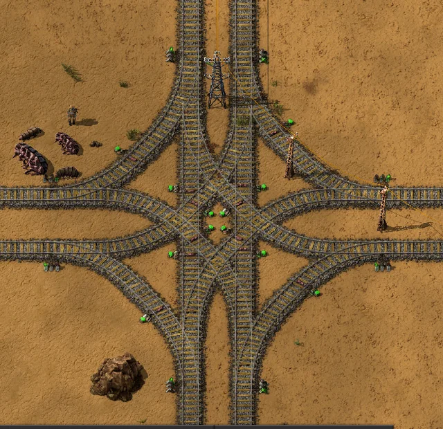
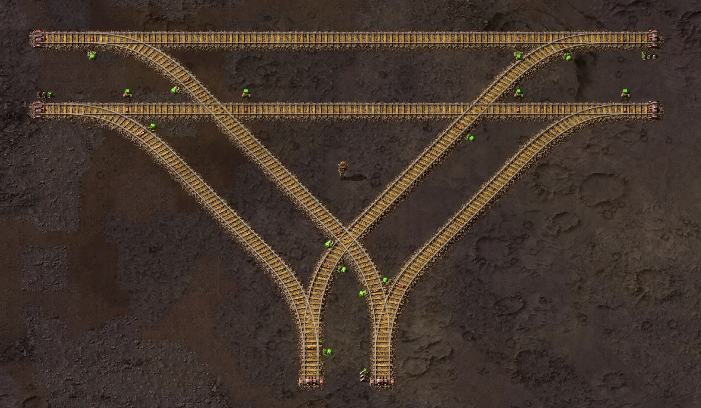
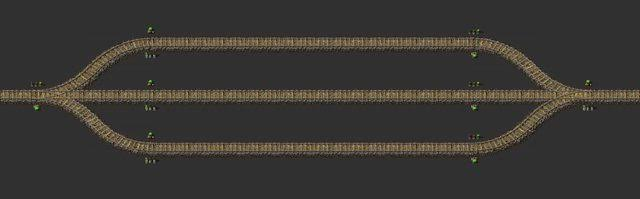
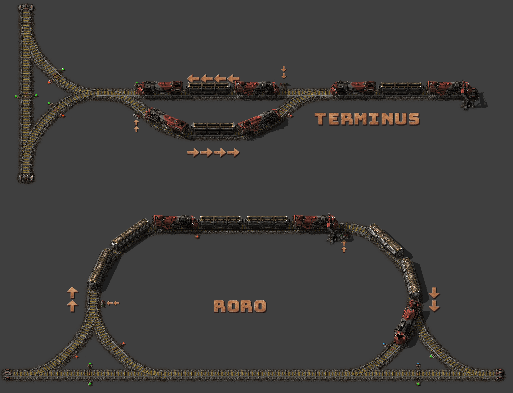
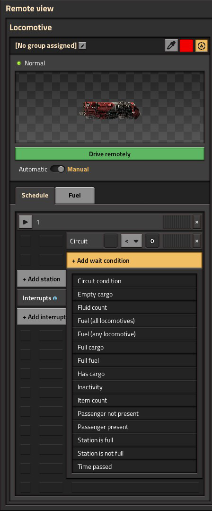
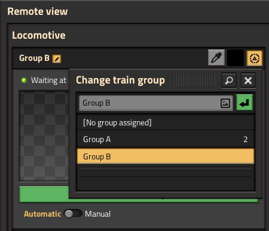

{/* _class: impact */}

# Factorio: Engineering Addiction

Week 6 — Rail Engineering

---

## Fluids on trains

Pipes have a real throughput ceiling once a fluid needs to travel far —
fluid wagons move the same fluids in bulk over a fixed route instead,
trading pipe segments for train capacity.

- a fluid wagon is filled and drained by pumps, not by the offshore pumps
  used to draw water from a body of water — different tool, same word,
  and only three pumps can attach to a single fluid wagon at once, a hard
  ceiling on how fast one wagon can load or unload regardless of station
  design
- a cargo wagon has a bigger ceiling but the same shape: up to twelve
  inserters can work one wagon, six per side — station throughput scales
  with inserter count up to that limit, then stops scaling no matter how
  much more track or how many more chests get added

---

## When rail beats pipe

- moving a fluid by rail instead of pipe only pays off once the distance is
  long enough that pipe throughput (covered in Week 4) would otherwise be
  the bottleneck
- the trade is the same one belts and rail always make: rail wins on long
  fixed routes, direct connection wins at short range

---

## Trains: acceleration

Two properties decide how a rail network behaves under load: acceleration,
set by locomotive count and fuel grade, and braking distance, set by the
wagon-to-locomotive ratio.

- a single locomotive with no wagons tops out at 72 tiles/second, reached
  at 9.26 tiles/second² of acceleration — every other figure here and on
  the next slide varies those two baseline numbers
- acceleration is proportional to forward-facing locomotives divided by
  total train mass — two forward-facing locomotives roughly double it for
  the same wagon count, and adding wagons without locomotives dilutes it
- better fuel raises both acceleration and top speed (solid, rocket and
  nuclear fuel each add a further step) — more locomotives raise both
  further still

---

## Trains: braking and length

- braking distance depends only on the wagon-to-locomotive ratio, not
  overall length — a 1-4 and a 2-8 train (same ratio) brake over the same
  distance, because deceleration is proportional to (wagons + locomotives)
  ÷ total mass, and that ratio is unchanged by simply doubling everything
- **train length is a real design constraint, decided once, upfront**: every
  signal and passing-track spacing rule downstream assumes a known maximum
  length — pick it before laying rail

---

## Intersections

A block is a length of track with no signal breaking it — Factorio's only
rule is that at most one train occupies a block at a time, and a train
long enough to span several blocks at once occupies every one of them,
not just the one its front end is in. Regular signals and chain signals
enforce that rule differently, and mixing them up is where deadlocks come
from.

- a **regular signal** turns red once a train enters the block ahead — safe
  to place where a train may sit and wait, since nothing else needs that
  space
- a **chain signal** looks past itself to the signal after it, turning red
  if *that* block is occupied too — what a train must see before entering
  a junction, crossing, or station throat it must not stop inside of

---

## Signal colours and spacing

- the colour a signal actually shows follows directly from the rule it
  enforces: green means the block ahead is free, yellow means a train has
  already been given approval to enter it, red means it's occupied — a
  chain signal instead shows blue when at least one of the paths past it
  is blocked, but not all of them
- after any regular signal, leave at least the longest train's worth of
  clear track before the next one — two junctions placed too close, each
  individually signalled correctly, can still lock two trains against
  each other

---

## Intersections, in practice


*Source: Factorio Wiki, CC BY-NC-SA 3.0.*

The waiting train's chain signal is doing its job here — it won't enter
until the far side is clear enough for the whole train, not just the front
of it.

---

## Junction examples

"An intersection" covers a range of actual shapes, and each one changes
where chain signals have to go.

- a **fork** (one line splitting into two) only needs a chain signal on the
  shared approach — once a train has committed to a branch, that branch
  behaves like ordinary single track
- a **crossing** (two lines meeting at grade) needs chain signals on every
  approach, because any of the four directions can be the one a train must
  not stop inside of
- a multi-track **interchange** is the same rule applied repeatedly — more
  approaches, but still just "chain signal anywhere entering a block a
  train can't fully clear"

---

## Junction examples, in practice



*Source: Factorio Wiki, CC BY-NC-SA 3.0.*

Every crossover here is another approach a chain signal has to guard —
more track shapes, same one rule from the last slide.

---

## Merges need more signals than forks

A fork and a merge aren't signalled the same way, even though both look
like "one line becomes two" from a distance — the rule that decides it is
what a train can't be allowed to stop inside of.

- a **fork** needs a chain signal only on the shared approach — once
  committed to a branch, that branch is ordinary single track and a
  regular signal is enough
- a **merge** needs a chain signal on *every* approach, because either
  train could end up the one stopped inside the shared block —
  chain-signalling only one side still lets the other commit into an
  occupied merge
- the wiki names exactly this — an uncontrolled crossing or merge — as a
  common cause of full network deadlock, where a train stops mid-junction
  and nothing behind it can move either

---

## Merges, in practice



*Source: Factorio Wiki, CC BY-NC-SA 3.0.*

Two merges, not one — every curve landing on that shared track needs its
own chain signal, which is twice the signalling a single fork this size
would need.

---

## Bypass sections, in practice



*Source: Factorio Wiki, CC BY-NC-SA 3.0.*

This is this week's practical in miniature — a three-lane line with a
bidirectional middle section is exactly this shape, signalled so opposing
trains never contest the shared block at the same time.

---

## Stations

A station is only as good as its slowest interaction with a train — most
rail networks that seem too slow are actually bottlenecked at loading or
unloading, not on the track between stations.

- station throughput sets a hard ceiling on how much a rail line can move,
  independent of train speed — a fast train sitting at a slow station
  doesn't move any more cargo per hour than a slow one would
- train stop names double as the addressable target for schedules — two
  stops sharing a name let a train pick whichever *empty* one is free,
  breaking ties between multiple empty options with a priority value
  (0-255, default 50) — this is what lets a station scale past one bay

---

## Station limits and placement

- a train stop's **train limit** caps how many trains may currently path
  to it as a destination; once full, a train destined there waits
  elsewhere rather than queueing on the main line — the setting a
  stacker (next slide) exists to make use of
- a train stop must sit on the right-hand side of the track in its
  direction of travel — placed on the left, a train can path *toward* it
  but never actually reach it, which the wiki names as the single most
  common cause of a "no path" error on an otherwise correctly-signalled
  line

---

## Station fuelling and design order

- fuelling only works while a train is parked at a station or driven
  manually — an inserter can't top up a locomotive that's merely waiting
  at a signal or running in automatic mode, so a train that leaves a
  station under-fuelled can strand itself mid-route with no way to refuel
  until it reaches another stop
- design the loading/unloading rate first, then size the rest of the
  network to match it, not the other way around

---

## Stackers

A stacker is a length of parallel holding track near a busy station,
sized to hold several waiting trains at once — it exists because a train
limit only stops a train from *selecting* a full destination, not from
occupying a signal block somewhere else in the meantime.

- without a stacker, a train limit still works — no more trains end up at
  the station than the limit allows — but a turned-away train waits
  wherever it happened to be, often on the main line other trains need
- a stacker gives it somewhere specific to wait instead, off the route
  everything else is trying to use
- sized for the busiest realistic queue, not the average one — an
  undersized stacker just moves the same jam a few blocks further back

---

## Terminus and loop stations

Every station is either a stub a train reverses out of, or a loop it
drives straight through — the choice changes what the train looks like.

- a **terminus** (stub-end) station needs a locomotive on both ends, or
  it can't leave without reversing — a single-headed train arriving here
  is stuck until turned around
- a **loop** station ("RORO," roll-on-roll-off) curves the train back
  onto the outbound track, so a single-headed train drives straight
  through and never reverses
- the trade is space for simplicity: a loop costs the track and footprint
  for the curve; a terminus costs a second locomotive, fuel and
  maintenance on every train that uses it

---

## Terminus and loop stations, in practice



*Source: Factorio Wiki, CC BY-NC-SA 3.0.*

Same job, two different train requirements — a terminus buys its
simplicity back with an extra locomotive; a loop buys it with track.

---

## Automating train lines

Automatic mode turns a train's schedule — a sequence of named stops, each
with a wait condition — into the entire driving logic; nothing about it
requires a human at the controls, or even present.

- a wait condition (full cargo, empty cargo, inactivity, a circuit signal)
  decides when a train leaves a stop, not a fixed timer — lets a schedule
  adapt to actual supply and demand instead of a guessed interval
- named stops plus simple conditions are enough for a train to run an
  entire loop unattended — no circuit-network logic needed yet, that's
  Week 10's territory
- a badly-chosen wait condition looks identical to a correctly automated
  line until supply runs out and the train waits at an empty stop forever

---

## Schedules, in practice



*Source: Factorio Wiki, CC BY-NC-SA 3.0.*

---

## Schedules, in practice: groups



*Source: Factorio Wiki, CC BY-NC-SA 3.0.*

A schedule is edited once per group, not once per train — adding a train
to an existing group hands it the same stop list and wait conditions
immediately, with nothing to re-enter by hand.

---

{/* _class: quote */}

> A block enforces one rule: one train at a time. Every deadlock is a place someone forgot which signal makes a train wait, and which one makes it commit.

Regular signals are for waiting. Chain signals are for not committing to
somewhere you can't finish getting through.

---

## This week's practical

```txt
Goal: three-lane rail line, middle lane running bidirectionally
Test: run trains from both directions on the middle lane at once
Pass: the middle lane carries opposing traffic without a deadlock, and the
      design is explained in terms of signal blocks, not trial and error
```

Explain the signalling before you run the test — if you can't say which
signals are regular and which are chained and why, the test passing is
luck, not design.
