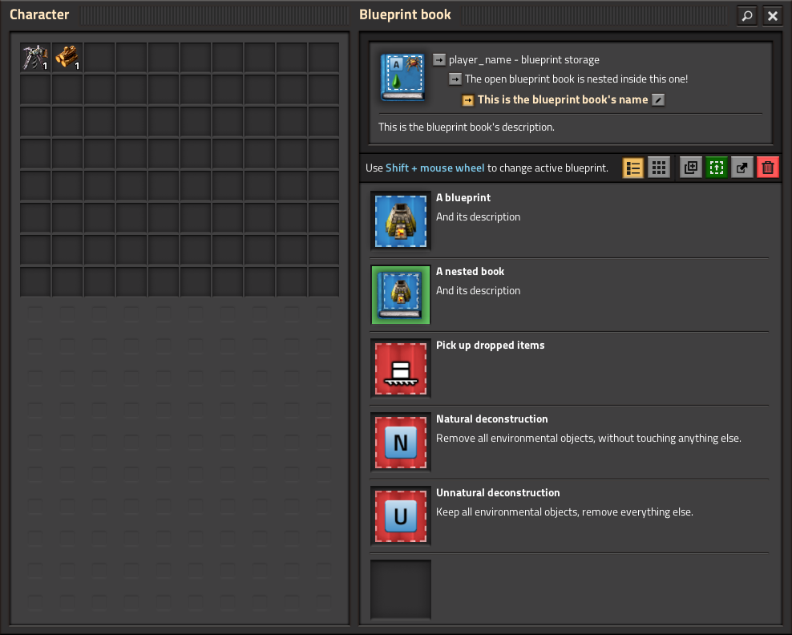

{/* _class: impact */}

# Factorio: Engineering Addiction

Week 7 — Coordinating at Scale

---

## One shared factory

Cooperative multiplayer puts every player on the same force by default:
one shared technology tree, one shared logistics and construction-robot
network, no walls between what any one player built. Everything from here
is a consequence of that.

- research points contributed by any player advance the same tech tree —
  there's no such thing as "your" research finishing before "mine"
- construction and logistic robots serve the whole force's network, not
  whoever placed the roboport — a bot will happily carry your teammate's
  request
- there is no built-in ownership of a build — anything one player places,
  another can walk up to and rebuild, wire into, or tear out

---

## Multiplayer and the inefficiency of differing solutions

Because the factory is genuinely shared, two players solving the same
subsystem independently doesn't produce two solutions to compare — it
produces one broken subsystem, built twice, in the same space.

- a second red-science line built next to an existing one without
  coordination usually means both compete for the same ore patch or belt
  lane, not that the base now makes twice as much
- rework compounds: fixing a collision after the fact costs more than
  agreeing on one design before either player starts
- this is a coordination problem, not a skill problem — two competent
  players with no shared plan produce worse results than two players with
  a plan and less individual skill

---

## Role allocation

Splitting the base into owned zones or subsystems gives every decision
exactly one owner, which is what actually prevents the collision above —
not skill, not communication volume, just a clear boundary.

- a zone can be spatial (the north ore patch), or functional (whoever owns
  "science" owns every lab and every belt feeding one, wherever it
  physically sits)
- an owner doesn't mean nobody else touches it — it means disputes about
  that zone resolve to one person, instead of staying unresolved until
  something breaks
- role allocation has to happen before building starts, not after —
  retrofitting ownership onto a base that's already half-built by two
  people with different plans is the expensive version of this problem

---

## Management: conventions that scale

Beyond who owns what, a small set of conventions agreed once removes the
need to ask before every decision — the team scales past "constantly
checking with each other" to "trusting the convention holds."

- a shared belt-colour or item convention means a player extending someone
  else's line doesn't have to ask what's on it
- consistent train stop naming lets every player read a schedule and know
  what a stop is for, without asking whoever built it
- agreeing on bus contents (what's on it, in what order, at what width)
  before either player starts building against it avoids the single most
  common cross-player collision in a shared base

---

## Management, in practice



*Source: Factorio Wiki, CC BY-NC-SA 3.0.*

A blueprint book with named, described entries is a convention made
durable — the agreement doesn't live only in a chat log, it's sitting in
the game, ready for anyone on the team to place.

---

{/* _class: quote */}

> Two competent players with no shared plan will out-build each other before they out-build the factory.

Role allocation and shared conventions aren't overhead on top of the
building — they're what makes the building add up instead of cancel out.

---

## This week's practical

```txt
Goal: form the Group Project team and agree on how it will work, before
      anyone touches the shared save
Test: the group is recorded, roles are assigned, a convention is written
      down
Pass: a group is formed and recorded before the tutorial ends; each member
      has an assigned zone or subsystem, agreed by the group; a shared
      convention (belt colour, stop naming, or bus contents) is written
      down, not left implicit
```

The save this produces is the one Assignment 2 marks at the end of Week
12 — the conventions agreed today are the ones the whole project has to
live with.
