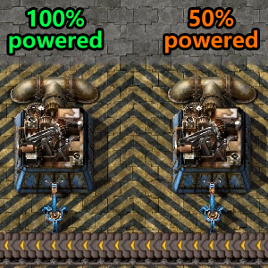
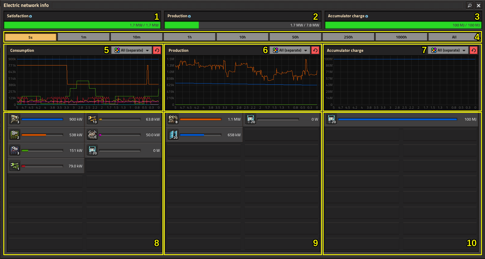
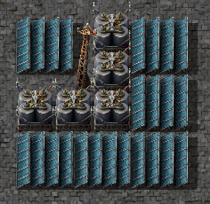

{/* _class: impact */}

# Factorio: Engineering Addiction

Week 8 — Diagnosing the Factory

---

## Brownouts

When demand outstrips supply, the network doesn't pick winners and losers
— every machine on it slows down together, in proportion to how much
power it's actually getting.

- if a network needs 300 kW total but only 180 kW is available, every
  machine on it runs at 60% speed (180/300), not some machines at full
  speed and others off
- because the slowdown is even and proportional, a brownout shows up
  everywhere at once — which is exactly why it's easy to mistake for a
  bottleneck in whatever line you happen to be looking at
---

## Brownouts, continued

- a stopped machine still draws power just for existing on the network,
  separately from the power it draws while working — an assembling
  machine 1's drain is 3 kW, on top of 90 kW of consumption while it's
  actually crafting, so an idle machine isn't a zero-demand machine
- the brownout itself is a symptom: the actual fault is upstream, in
  generation capacity or accumulator charge, not in the slowed machines
  themselves

---

## Brownouts, in practice



*Source: Factorio Wiki, CC BY-NC-SA 3.0.*

Every machine in this clip slows by the same fraction at the same
moment — that shared, simultaneous slowdown is the brownout signature the
next slide's info screen puts a number on.

---

## Electric network info, in practice



*Source: Factorio Wiki, CC BY-NC-SA 3.0.*

Satisfaction below 100% is the tell — check this screen before touching
any individual machine, since a slow assembler here is innocent.

---

## Generation priority

When a network has more than one kind of generator, demand isn't split
evenly between them — it's satisfied in a fixed order, and that order is
itself a diagnostic tool.

- **solar panels first** — they run at full output whenever daylight
  allows, and only throttle down once they alone already cover 100% of
  demand
- **steam engines, steam turbines and (Nauvis) fusion generators share
  next**, at equal priority to each other — whatever solar didn't cover,
  they split between themselves
---

## Generation priority, continued

- **accumulators are strictly last resort**: they only discharge once
  every other source is already maxed out and demand still isn't met, and
  they only charge once every source has fully met demand with surplus
  left over
- this ordering is why a brownout at night with steam backup still
  running fine points at insufficient steam capacity, not at accumulators
  — accumulators were never going to be asked for more than steam already
  refused to cover

---

## Why solar

Steam and nuclear both need a continuous fuel supply; solar's whole appeal
is not needing one.

- no fuel logistics, and (with enough accumulators) no exposure to a biter
  attack cutting a fuel line — a boiler or reactor cut off from fuel stops
  producing, solar just draws down stored charge
- it's also the cheapest power source to simulate: panels and accumulators
  are calculated in bulk across the network, while boilers and especially
  nuclear reactors carry real per-segment fluid simulation cost — at
  megabase scale this UPS difference is usually the deciding factor, ahead
  of raw power density
---

## Why solar, continued

- the trade-off is footprint and upfront cost: nuclear packs far more
  power per tile once built, solar just needs more panels laid down over
  time
- on the supply side, the same offshore-pump ratio scales the same way it
  did in Week 1: one offshore pump supplies enough water for 200 boilers
  and 400 steam engines — check that ratio against actual demand before
  assuming a steam shortfall is a diagnosis rather than a guess

---

## Solar and accumulator ratio

A solar field alone only covers daylight — accumulators are what carries
that surplus through the night, and the two have to be sized together
against each other, not separately.

- the documented full day-night ratio on Nauvis is 25 solar panels to 21
  accumulators (normal quality) for a self-sufficient network — roughly
  0.84 per panel, often rounded to 6:5 for quick sizing; sizing panels
  directly against total demand takes 23.8 panels per megawatt required
- undersizing accumulators against panel count doesn't show up during the
  day — it shows up as a brownout a few hours after sunset, once stored
  charge runs out

---

## Solar and accumulator ratio, continued

- oversizing panels without matching accumulators wastes daytime surplus —
  the ratio, not the raw panel count, decides whether the base survives
  the night
- running out of *stored* charge isn't the only accumulator failure mode
  — each one caps its discharge at 300 kW no matter how much energy it's
  holding, so a sudden heavy load (a laser wall opening fire) can brown
  out a fully-charged accumulator bank simply because it can't push power
  out fast enough
- steam storage doesn't have this ceiling nearly as low: a steam engine
  discharges stored steam at 900 kW, a turbine at 5,800 kW — three and
  roughly six times an accumulator's rate — which is why a burst-load
  network leans on stored steam, not stored charge, for headroom

---

## Storage tanks as energy banks

Steam isn't only useful for its discharge rate — a storage tank also
banks the same energy far more densely than an accumulator array does.

- one tank of 165°C boiler steam holds 750 MJ, the same as 150
  accumulators; one tank of 500°C heat-exchanger steam holds 2,400 MJ,
  the same as 480 accumulators
- in the same 3×3 footprint, an accumulator array holding that much
  charge would need roughly a hundred tiles more to match

---

## Solar and accumulator ratio, in practice



*Source: Factorio Wiki, CC BY-NC-SA 3.0.*

A block sized once like this tiles cleanly across a field — sizing panels
and accumulators separately, then bolting them together after the fact,
is how the ratio drifts off without anyone deciding it should.

---

## Pole networks

A network that looks like it should be one continuous grid can split
into two without any visible gap in coverage — the cause is usually the
poles themselves, not a missing connection.

- a newly-placed pole auto-connects to the nearest available poles, but
  the game refuses to complete a 3-pole triangle — if two poles are
  already connected to each other, a third pole won't form the closing
  side of that triangle even if it's in range of both
---

## Pole networks, continued

- no pole connects to more than 5 others at once — past that, the
  auto-connect logic skips it in favour of poles with room left, which
  can silently route power around a busy junction pole instead of
  through it
- both rules only affect *auto*-connection — manually dragging a wire
  with the copper wire tool can still form a triangle or a 6th
  connection on purpose, which is sometimes exactly what a segmented
  network needs

---

## Identifying bottlenecks

Guessing which machine is "the" bottleneck wastes time — the same
symptom can come from three different layers, checked in order from the
ground up.

1. **Machine utilisation** — running, or idle waiting on an ingredient?
   The status icon says which.
2. **Buffer levels** — is a buffer or output slot full or empty? Full
   means downstream is the constraint; empty means upstream is.
3. **Belt saturation** — is the belt at capacity between two points that
   are each fine alone? Neither machine beside it can see that.

Checking in order finds the actual constraint, not the first
slow-looking machine you notice.

---

## Parallel versus series production

Once a line is bottlenecked, there are exactly two ways to add capacity —
build another line beside it, or make the existing line faster — and they
aren't interchangeable once ratios are already tight.

- **parallel** (another identical line) adds throughput linearly and
  doesn't touch the existing ratio, but costs the footprint and input
  supply of a whole second line
- **series** (speed modules, beacons, or a faster machine tier on the same
  line) raises throughput without adding footprint, but changes the
  machine's input consumption rate — every ratio feeding that machine has
  to be rechecked, not just the machine itself
- speeding up one step in an already-tight chain without touching the
  others just moves the bottleneck one step over, it doesn't remove it

---

## Discussion: the everlasting chip shortage

Green circuits are usually the first thing a growing base runs short of,
and "build another green circuit line" is rarely the whole fix, because
circuits sit at the base of almost every other recipe.

- demand for green circuits grows with nearly everything else being
  built, so a shortage here isn't isolated the way a shortage of a
  specialised intermediate would be
- adding a parallel green-circuit line without checking what it's now
  competing with for copper and iron plate can just relocate the shortage
  one step upstream
- this is this week's diagnostic method applied to a specific,
  practically inevitable case: check utilisation, buffers and saturation
  before assuming "more circuits" is the fix

---

{/* _class: quote */}

> A brownout tells you the network is short on power. It doesn't tell you which machine to blame — that's a different question, checked a different way.

Diagnosis is a sequence, not a guess: identify which layer the symptom is
actually coming from before changing anything.

---

## This week's practical

```txt
Goal: diagnose a supplied base showing a brownout and an unrelated
      bottleneck, and fix both root causes — Assignment 1 is due this week
Test: check utilisation, buffer levels and belt saturation in order,
      keeping the power problem and the production problem separate
Pass: the brownout's root cause is identified, not just the symptom; the
      unrelated bottleneck is correctly separated from the power issue;
      both are fixed, and the fix for one didn't mask or worsen the other
```

The same method — checked in the same order — is what Assignment 1 expects
you to demonstrate in writing.
