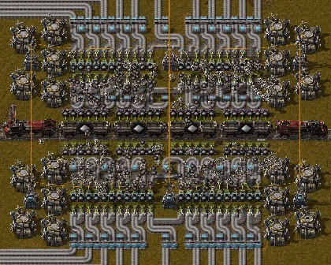
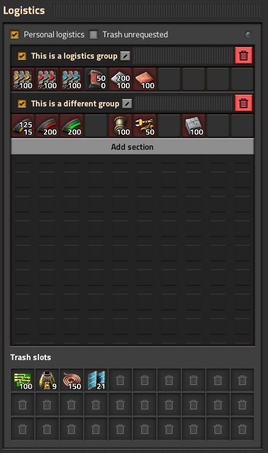
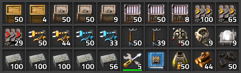
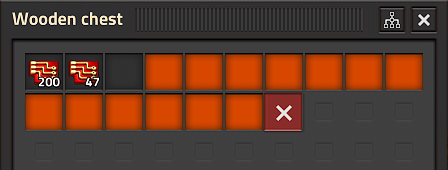

{/* _class: impact */}

# Factorio: Engineering Addiction

Week 9 — Blueprints at Scale

---

## Bots

Construction robots are what turns a captured design back into a real
structure — and how fast that happens is set by roboport coverage, not by
how big the blueprint is.

- a roboport's logistic area (where both logistic and construction robots
  operate) is 50×50 tiles; its construction area (construction robots
  only) is a larger 110×110 tiles
- two roboports link into a single network once their logistic areas
  touch or overlap — robots then travel directly between any two points in
  the combined network, not just within one roboport's own coverage

---

## Bot networks

- bots don't migrate to a different nearby network on their own — only if
  their home network is destroyed outright (every roboport in it removed
  or cut from power) do they look elsewhere
- a large blueprint dropped where robot and material supply is thin
  doesn't fail, it just goes up slowly — construction speed is a resource
  question (robots and materials available), not a placement question

---

## Roboport charging

A blueprint's build-out speed has a hard ceiling set by how fast bots can
recharge, not by how many bots exist — this is the concrete mechanism
behind "goes up slowly" on the previous slide.

- each roboport has exactly 4 charging slots, charging each bot at 1 MW,
  taking 1.5 seconds per bot — in practice that's roughly 50-70 bots/min
  through one roboport, not more, however many bots are queued
- a roboport also carries a 100 MJ internal battery, letting it keep
  charging bots for a while even through a brief power dip

---

## Roboport charging, at scale

- when a roboport's charging queue gets long, bots slow down rather than
  wait idle — and past a point they'll peel off to a more distant
  roboport instead, provided that port isn't more than (queue size ÷ 2)
  tiles further away
- more roboports spread through the coverage area is a real throughput
  fix here — one enormous roboport-starved zone doesn't parallelise no
  matter how many bots are dispatched into it

---

## Bot flight and range

Range and speed aren't roboport settings — they're a fixed energy budget
per bot, and that budget is what actually limits how far a delivery can
travel from the network.

- a bot carries 1.5 MJ of energy, spends 3 kW just by being airborne, plus
  5 kJ for every tile it covers — running that budget down gives a
  maximum range, not an estimate: `1500 ÷ (3 ÷ speed + 5)` tiles
- with no speed research, that formula gives 250 tiles for logistic
  robots (base speed 3 tiles/s) and 257 for construction robots (3.6
  tiles/s) — construction bots go slightly further because they're
  slightly faster, spending less time (and 3 kW-of-time) per tile

---

## Bot range budget in use

- a bot heads back to recharge once it hits 20% of its energy — so 80% of
  its usable range is spent travelling toward the target, the remaining
  20% toward a charging point instead
- a bot that runs out of charge entirely doesn't stop — it drops to 20%
  of normal flying speed and limps to the nearest roboport that's still
  progress toward its destination, rather than backtracking

---

## Bots, in practice


*Source: Factorio Wiki, CC BY-NC-SA 3.0.*

That dashed line is the network, not just the two ports — everything
between them is now reachable in one delivery, provided the chain of
overlapping coverage holds.

---

## Logistic chest types

"Put a chest down" isn't one decision — five chest types exist
specifically because a network needs to distinguish "always take from
here," "take if nothing better," "keep until wanted," and "fill this up"
as different behaviours, not just different inventories.

- **active provider** — pushes its contents into the network
  immediately and unconditionally; emptied first, ahead of everything
  else
- **passive provider** — offers its contents to the network, but only
  once nothing higher-priority is available; the default choice for "the
  output of a machine," per the practical's own goal

---

## Logistic chest types, continued

- **buffer** — a requester and a passive provider in one: it fills to a
  requested amount, then offers that stock onward at passive-provider
  priority, useful as a mid-tier reserve between production and delivery
- **storage** — holds whatever gets dumped on it with nowhere else to
  go, and self-organises: bots prefer a storage chest already holding
  that item type over an empty one, which is why a storage array
  gradually sorts itself by item without anyone arranging it
- **requester** — pulls a configured amount from the network; the
  player and requester chests get first claim on incoming deliveries,
  buffer chests are served after

---

## Chest priority order

Five chest types only work as a system because pickup and delivery each
follow one fixed order, not first-come-first-served.

- pickup order runs active provider → storage/buffer → passive provider;
  delivery order runs player/requester → buffer
- getting this backwards — an active provider chest used as ordinary
  storage, say — means the network drains it immediately, not on demand

---

## Logistic chest types, in practice



*Source: Factorio Wiki, CC BY-NC-SA 3.0.*

This is the priority order made visible: the active provider chests get
emptied on sight, feeding straight into whatever's requesting — exactly
why bots, not belts, handle the very short, very high-throughput hop at
a train stop like this one.

---

## Bot cargo and reservations

A bot's stated inventory number and what's actually sitting in the
network can disagree, and it isn't a bug — it's the network showing its
work.

- a bot carries 1 item by default (research raises this) — cargo
  capacity, not travel speed, is what worker robot cargo size research
  actually buys
- the network's item count is what's in provider/buffer/storage chests
  *minus* whatever's already been reserved by a bot en route to collect
  it — a bot always reserves its full carrying capacity the instant it's
  dispatched, even if the chest doesn't currently hold that much

---

## Reading a negative count

- that reservation is why the count can briefly go negative: a network
  with 1 iron plate and a bot capable of carrying 4 shows -3 the moment
  that bot commits, and settles back to 0 once it actually arrives and
  finds more had been added in the meantime
- negative numbers aren't a deficit against requester demand — with no
  bots actively picking anything up, the count never goes negative no
  matter how much is being requested

---

## Blueprints

A blueprint isn't a picture of a layout — it's a captured configuration:
every entity's position, and everything wired into it, ready to be placed
again exactly as it was.

- circuit network connections and combinator signal conditions are part of
  the capture, not just the physical entities — a blueprint of a
  circuit-controlled line reproduces the logic, not just the belts
- capturing a working design with bots (select the area, confirm the
  blueprint) is the same operation whether it's five entities or five
  hundred — scale doesn't change the process, only what gets checked
  afterward

---

## Blueprints and logistics groups

- a blueprint is only as good as the design it was taken from — it
  reproduces mistakes exactly as faithfully as it reproduces working
  ratios
- a logistics group name (a named set of logistic requests on a
  requester or buffer chest) is captured too, but groups are global by
  name, not per-blueprint — pasting a blueprint into a world where a
  group of that name already exists makes the new chests adopt the
  *existing* group's requests, not the ones saved in the blueprint,
  silently

---

## Blueprints, in practice



*Source: Factorio Wiki, CC BY-NC-SA 3.0.*

Groups are named and toggled here, and that name is the thing a
blueprint actually carries — reusing a name on purpose shares one edit
across every chest tagged with it; reusing one by accident is the
silent-adoption trap from the previous slide.

---

## Stack sizes

Blueprint sizing and chest-capacity planning both come back to one
number per item — its stack size — which is not the same across items
and isn't obvious just from looking at an icon.

- stack size runs in a small set of fixed tiers: 1 (nuclear fuel,
  blueprints, modular armor), 50 (ores, modules, all assemblers and
  chests, gun and laser turrets), 100 (plates, gears, belts, pipe,
  concrete), 200 (circuits, science packs, ammo magazines)

---

## Chest capacity and stack limits

- a chest's usable capacity is stack size × slot count, so two chests
  holding different items are rarely holding the same *amount* even at
  the same fill level — a full chest of iron plate (100/stack) holds far
  more items than a full chest of gun turrets (50/stack)
- a chest or wagon's stack count can also be manually capped below its
  default, freeing space without adding a whole extra container — useful
  for stocking a small buffer without dedicating a full chest's worth of
  resources to it

---

## Stack sizes, in practice



*Source: Factorio Wiki, CC BY-NC-SA 3.0.*

---

## Stack limits, in practice



*Source: Factorio Wiki, CC BY-NC-SA 3.0.*

Same mechanic underneath both images — a slot holds one stack of one
item, and that stack's size is fixed per item, whether or not the slot's
limit has been manually capped below it.

---

## Tiling

A tileable blueprint is one whose edges were designed on purpose, so that
placing a second copy directly against the first needs no manual
patching — belts, pipes and power all pick up across the seam.

- belts on one copy's edge continue into the next only if they're the same
  lane, same direction, and directly adjacent — a one-tile gap or a lane
  on the wrong side breaks the connection
- pipes connect the way pipes always do: two ends occupying adjacent tiles
  join automatically, so the edge just needs matching pipe positions

---

## Tiling: power poles

- power poles auto-connect within wire range, but not without limits — no
  pole auto-connects to more than 5 others, and two already-connected
  poles won't auto-accept a third that would close a triangle between
  them (covered in Week 8) — an edge pole can silently fail to bridge to
  the next copy's for either reason, worth checking, not assuming

---

{/* _class: quote */}

> A blueprint that only tiles by luck stops tiling the first time the layout changes.

Designing the edge deliberately — matching lanes, matching pipe ends,
checking wire reach — is what makes tiling a property of the design, not
an accident of this one placement.

---

## This week's practical

```txt
Goal: a tileable blueprint converting iron and copper plate to green
      science packs
Test: capture the design with bots, then place a second copy edge to edge
      with the first
Pass: the blueprint converts plate to green science packs at a stated
      ratio; two copies placed edge to edge connect belts, pipes and
      power without manual patching; the blueprint is captured with bots,
      not placed by hand
```

Keep this blueprint once it passes — Week 11's megabase-scale work assumes
tiling discipline like this is already solved.
