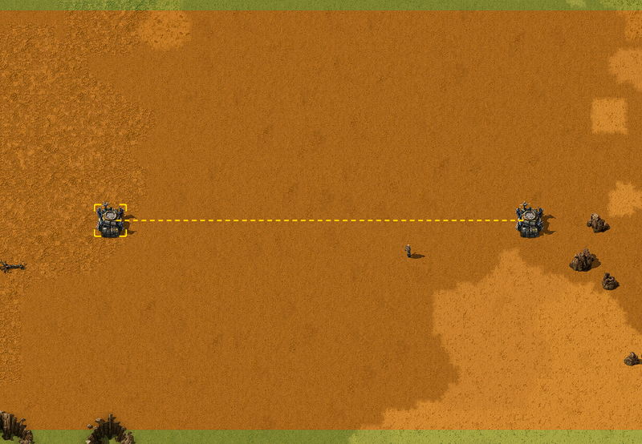

{/* _class: impact */}

# Factorio: Engineering Addiction

Week 9 — Blueprints at Scale

---

## Bots

Construction robots are what turns a captured design back into a real
structure — and how fast that happens is set by roboport coverage, not by
how big the blueprint is.

- a roboport's logistic area (where both logistic and construction robots
  operate) is 50×50 tiles; its construction area (construction robots
  only) is a larger 110×110 tiles
- two roboports link into a single network once their logistic areas
  touch or overlap — robots then travel directly between any two points in
  the combined network, not just within one roboport's own coverage
- a large blueprint dropped where robot and material supply is thin
  doesn't fail, it just goes up slowly — construction speed is a resource
  question (robots and materials available), not a placement question

---

## Bots, in practice



*Source: Factorio Wiki, CC BY-NC-SA 3.0.*

That dashed line is the network, not just the two ports — everything
between them is now reachable in one delivery, provided the chain of
overlapping coverage holds.

---

## Blueprints

A blueprint isn't a picture of a layout — it's a captured configuration:
every entity's position, and everything wired into it, ready to be placed
again exactly as it was.

- circuit network connections and combinator signal conditions are part of
  the capture, not just the physical entities — a blueprint of a
  circuit-controlled line reproduces the logic, not just the belts
- capturing a working design with bots (select the area, confirm the
  blueprint) is the same operation whether it's five entities or five
  hundred — scale doesn't change the process, only what gets checked
  afterward
- a blueprint is only as good as the design it was taken from — it
  reproduces mistakes exactly as faithfully as it reproduces working
  ratios

---

## Tiling

A tileable blueprint is one whose edges were designed on purpose, so that
placing a second copy directly against the first needs no manual
patching — belts, pipes and power all pick up across the seam.

- belts on one copy's edge continue into the next copy's edge only if
  they're the same lane, same direction, and directly adjacent — a
  one-tile gap or a lane on the wrong side breaks the connection
- pipes connect the same way pipes always do: two pipe ends occupying
  adjacent tiles join automatically, so the edge just needs matching pipe
  positions on both copies
- power poles auto-connect to the nearest compatible poles in wire range
  when placed, up to five connections per pole — an edge pole only bridges
  to the next copy's edge pole if that pole is within wire reach across
  the seam, which is a distance the designer has to check, not assume

---

{/* _class: quote */}

> A blueprint that only tiles by luck stops tiling the first time the layout changes.

Designing the edge deliberately — matching lanes, matching pipe ends,
checking wire reach — is what makes tiling a property of the design, not
an accident of this one placement.

---

## This week's practical

```txt
Goal: a tileable blueprint converting iron and copper plate to green
      science packs
Test: capture the design with bots, then place a second copy edge to edge
      with the first
Pass: the blueprint converts plate to green science packs at a stated
      ratio; two copies placed edge to edge connect belts, pipes and
      power without manual patching; the blueprint is captured with bots,
      not placed by hand
```

Keep this blueprint once it passes — Week 11's megabase-scale work assumes
tiling discipline like this is already solved.
