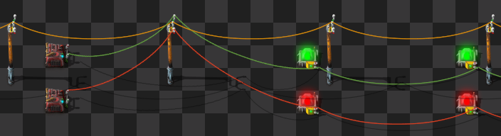
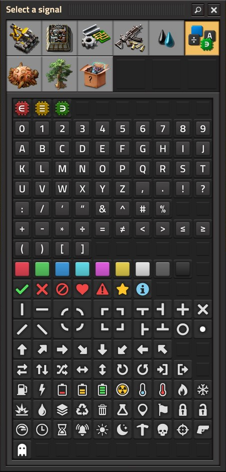
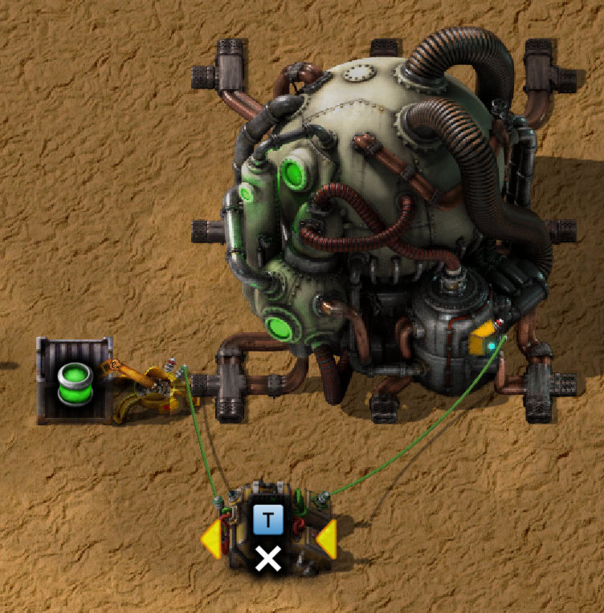
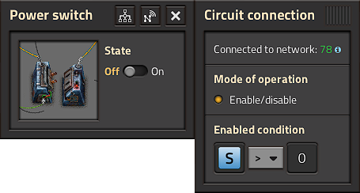

{/* _class: impact */}

# Factorio: Engineering Addiction

Week 10 — Advanced Optimisation

---

## Logic gates

Decider and arithmetic combinators are the circuit network's equivalent of
an if-statement and a calculation — everything this week's automation
does is built from just these two.

- a **decider combinator** compares an input signal against a condition
  (greater than, equal to, and so on) and outputs a signal only while the
  condition holds — the network's if-statement
- an **arithmetic combinator** takes one or two input signals and outputs
  the result of an operation on them (add, multiply, and so on) — the
  network's calculation
- chaining a handful of these is enough to express "only run this while
  that other thing is true," which is the pattern behind every example in
  this lecture

---

## Wire colours are independent networks

Red and green wire aren't a labelling convenience — they're two entirely
separate networks that happen to run down the same poles, and mixing
that up is a common source of a circuit "not working" for no visible
reason.

- wires of the *same* colour that touch anywhere — a shared pole, a
  shared device — merge into one network and sum their signals; a red
  wire and a green wire touching the same pole never merge, no matter how
  many devices sit on both

---

## Reading combined signals across colours

- a device wired to both colours reads their sum: an inserter connected
  to a red wire carrying 20 copper plate and a green wire carrying 10
  sees an input of 30, not two separate readings
- this is also how one pole can carry two logically unrelated networks
  at once — colour is the only thing keeping them apart, so a design
  that "shouldn't" be seeing another circuit's signal is almost always a
  same-colour wire touching somewhere it wasn't meant to

---

## Wire colours, in practice



*Source: Factorio Wiki, CC BY-NC-SA 3.0.*

One pole, two networks, zero interaction between them — the pole is
just a waypoint for wire reach, not a point where colours combine.

---

## Combinator timing

A combinator doesn't react instantly — every update is split into a
read-and-compute step and a broadcast step, one game tick apart, and
that one-tick lag is what makes a combinator wired back to its own
output dangerous.

- each of Factorio's 60 ticks/second has two phases: first every
  combinator reads its input network and computes its output, then the
  network updates to the sum of everyone's output — a decider's output
  from this tick isn't visible on the network until next tick
- that lag compounds through a chain: several combinators wired in
  series each add another tick of delay before a change at the start is
  visible at the end, which can desync signals that were meant to align

---

## Feedback loops: runaway or clock

- an arithmetic combinator wired so its own output feeds back into its
  own input is a real hazard, not a hypothetical one — "add 1 to copper
  plate, output copper plate" wired back on itself climbs without bound,
  at a rate set by the tick rate, not a one-off increment
- the same feedback mechanism is also how deliberate clocks and counters
  are built — a runaway loop and a working clock are the identical
  circuit, the only difference is whether a reset condition is wired in
  to break the loop before it becomes a bug

---

## Everything, anything and each

Three signals — Everything, Anything and Each — carry no value; they
change what a combinator's condition is evaluated *against*, letting one
decider watch every signal on a wire instead of one named one.

- **Everything** on the input side is true only if the condition holds
  for every nonzero signal present (vacuously true if there are none) —
  universal quantification; a signal on the *output* side of the same
  comparison is excluded from the check, so "everything > iron plate"
  doesn't trivially compare iron plate to itself
- **Anything** is true if the condition holds for at least one nonzero
  signal — existential quantification, false with no input at all; used
  as both input and output it returns the first matching signal (by
  Factoriopedia's fixed ordering)

---

## Each, and telling the wildcards apart

- **Each** runs the combinator's operation once per nonzero input
  signal independently, then sums the outputs onto the wire — the
  wiki's own description is a stack of identical combinators, one per
  signal, all wired in parallel; unlike Everything and Anything, a
  signal named on the output side is *not* excluded from the input set
- getting Everything and Each confused is an easy mistake with different
  results: Everything asks one yes/no question about the whole set,
  Each asks the same question once per signal and reports each answer
  separately

---

## Wildcards, in practice



*Source: Factorio Wiki, CC BY-NC-SA 3.0.*

These three sit apart from every other signal in this dialog for a
reason — they're not values a wire carries, they're instructions for how
a combinator should read the values already on it.

---

## Nuclear setups

A reactor's output scales with how many other reactors touch it, which
makes nuclear power a layout problem before it's a fuel problem — and the
same setup has one specific, well-known way to starve itself of fuel.

- every reactor gains +100% heat output for each **orthogonally** adjacent
  reactor — diagonals don't count, and the bonus affects heat only, never
  fuel consumption
- a 2×2 block means each reactor touches two neighbours (+200% each), so
  four reactors produce far more than four times one — only in a tight,
  fully-aligned grid

---

## Nuclear fuel and heat sizing

- fuel cells need 1 uranium-235 and 19 uranium-238 — raw processing yields
  U-235 only 0.7% of the time, so an uncontrolled line can drain a U-235
  stockpile faster than processing replaces it
- heat exchangers, not reactors, are what the rest of the plant sizes
  against: one reactor with no neighbour bonus needs 4 heat exchangers to
  consume all its heat, plus 4 more per +100% of neighbour bonus stacked
  onto it — a large installation's ideal ratio comes out to 2 pumps :
  233 heat exchangers : 400 turbines, roughly 1:116:200

---

## Uranium refining

Raw uranium processing alone can't sustain a reactor — it only yields
U-235 0.7% of the time, so a real setup needs a second step that turns
U-238 into more U-235 instead of waiting on luck.

- the **Kovarex enrichment process**, run in a centrifuge, takes 40 U-235
  and 5 U-238 and produces 41 U-235 and 2 U-238 per cycle — a net gain of
  1 U-235 paid for with 3 U-238, not a one-for-one conversion
- it needs a 40 U-235 stockpile just to start a cycle, and won't run below
  that floor — the process enriches an existing stockpile, it doesn't
  bootstrap one from nothing
- once Kovarex is running, raw processing's job shifts from "the" U-235
  source to just supplying U-238 and the occasional lucky U-235 top-up

---

## Nuclear setups, in practice



*Source: Factorio Wiki, CC BY-NC-SA 3.0.*

The decider combinator here is the gate: it's what stops the inserter from
loading another fuel cell before the reactor actually needs one.

---

## Worked example: fuel timing

A fuel cell burns for exactly 200 seconds regardless of how much power
is actually being drawn — nuclear doesn't throttle fuel use to demand
the way a steam engine does, so an ungated reactor burns cells on a
fixed clock even while mostly idle.

- read one shared steam storage tank as the "steam is running low"
  signal — every reactor in a multi-reactor group listens to the same
  tank, not its own, so they can be kept in sync
- the output inserter (empty-cell removal) is enabled only when steam
  is low *and* a fresh cell is available in the input chest; removing
  the spent cell is itself the signal the input inserter waits for

---

## Fuel timing, continued

- the input inserter has its stack size overridden to 1, so exactly one
  fresh cell goes in per empty-cell signal — never a stack at once
- for a multi-reactor block, only *one* output inserter should be wired
  to the shared steam signal; every other reactor's output inserter runs
  "dumb" (removes empty cells immediately) and follows the first
  reactor's insertion via the empty-cell signal — this is what keeps
  refuelling synchronised enough to hold the neighbour bonus

---

## Worked example: uranium prioritisation

Nuclear fuel production competes with every other use of uranium for the
same two isotopes — this circuit keeps a reserve for fuel production
before anything else gets a share.

- split incoming uranium onto two parallel belts (U-235, U-238), each
  read by an inserter gathering into its own container
- gate each gathering inserter on "belt ≥ X" and each belt itself on
  "container ≤ X," with X set to the fuel-cell recipe's own requirement
  — 1 U-235, 19 U-238 — so gathering only pulls uranium below that
  reserve floor, and the belt only keeps supplying downstream users once
  the reserve is topped back up

---

## Uranium prioritisation, continued

- gate the inserters feeding the fuel-cell assembler on "nuclear fuel
  stockpile = 0" (or below a chosen threshold), so uranium only leaves
  the reserve to make more fuel once the existing stockpile is actually
  low
- net effect: uranium flows to other uses by default, gets held back the
  moment the fuel reserve dips, and only feeds fuel production once
  there's a genuine shortfall — the reserve is protected without ever
  stopping the belts outright

---

## Logic-based rails

A train stop isn't limited to a fixed schedule — its dispatch behaviour
can be driven directly by circuit signals, so a train only comes when the
network's actual state calls for it.

- **enable/disable**: a circuit condition can switch a stop on or off; a
  disabled stop is skipped in favour of another stop sharing its name, or
  the train waits if none are available
- **train limit**: a circuit signal can set how many trains may currently
  be heading to a stop — a limit of 0 behaves identically to disabling the
  stop outright
- **priority**: when several stops share a name, a circuit signal can also
  set which one trains prefer, on top of enabling or limiting them

---

## On-demand trains

Combining a stock-level signal with a train stop's circuit conditions
turns "run a train every N minutes" into "run a train when the station
actually needs one" — the difference between guessing and reacting.

- reading a chest or tank's contents as a signal, then wiring that signal
  into the pickup station's enable condition, means a train is only
  dispatched once there's enough to justify the trip
- the same pattern at the delivery end — disabling the destination once
  its buffer is full — prevents a train arriving somewhere that has
  nowhere to put the cargo
- this is the same if-statement pattern from the start of this lecture,
  applied to a schedule instead of a single machine

---

## Hysteresis and the SR latch

A condition that switches on and off right at its own threshold doesn't
stay off — it chatters, flipping every tick the reading crosses back and
forth across the line. A latch fixes this by giving "on" and "off"
different thresholds instead of one shared one.

- an SR latch remembers a state instead of just reporting a condition:
  it sets ("remembers on") when a set condition is met, and only
  resets when a separate reset condition is met — as of Factorio 2.0 a
  single decider combinator, correctly configured, is enough to do this

---

## Hysteresis, continued

- the canonical example: turn a backup steam generator on when
  accumulator charge drops to 20%, but don't turn it back off until
  charge recovers to 90% — a single shared threshold (say, 50%) would
  cycle the generator on and off repeatedly as charge hovers near it
- this gap between the set and reset thresholds is hysteresis on
  purpose — it's not slop in the design, it's what stops a power switch
  (or any other latched output) from rapidly cycling near a boundary
  value

---

## Hysteresis, in practice



*Source: Factorio Wiki, CC BY-NC-SA 3.0.*

The power switch only cares about one signal being 0 or 1 — all the
hysteresis logic lives upstream, in the single decider combinator
deciding when that signal flips.

---

{/* _class: quote */}

> A fixed timer runs whether or not the network needs it. A circuit condition runs because the network needs it — that difference is the entire point of this week.

Every example tonight — reactor fuelling, train dispatch — is the same
gate, wired to a different question.

---

## This week's practical

```txt
Goal: a circuit-controlled uranium processing setup that runs
      continuously without jamming or starving
Test: vary the ore supply rate and confirm the setup holds unattended
Pass: no jamming across a supply-rate change; at least one circuit
      condition (not a fixed timer) governs part of the process; the
      failure mode it guards against is stated
```

State the failure mode before you wire the fix — a circuit condition
that's just there because it seemed like a good idea isn't the same as
one guarding against a stated way the setup jams.
