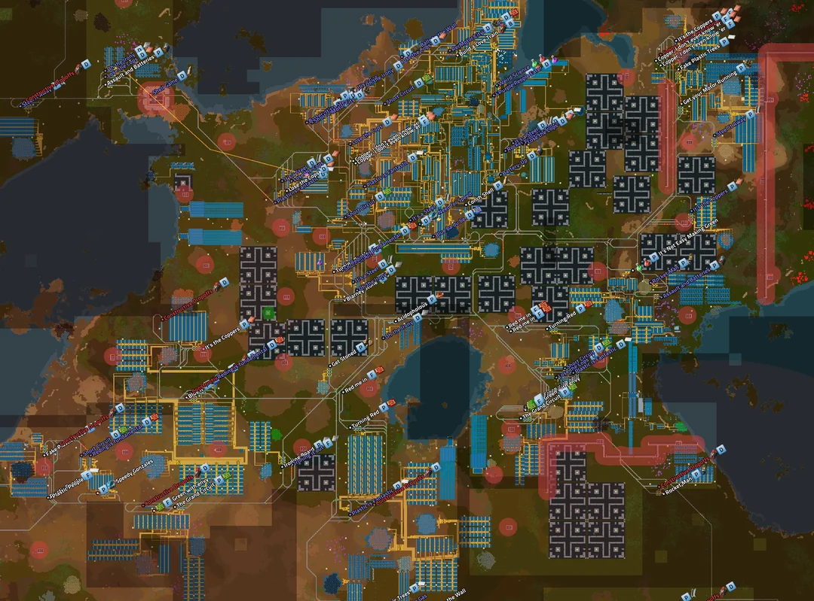
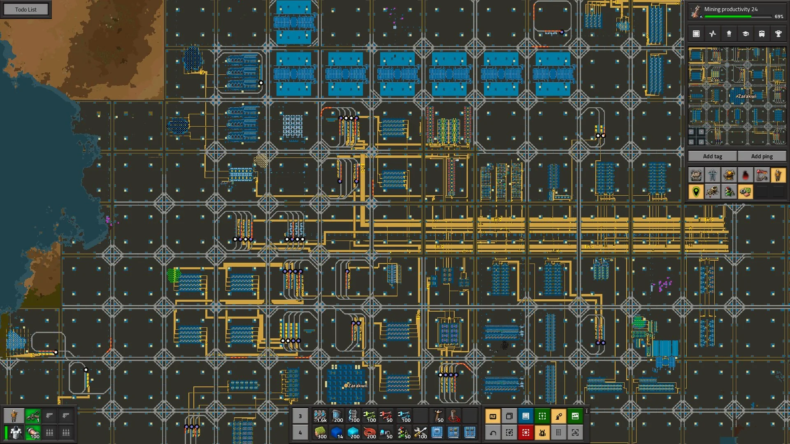
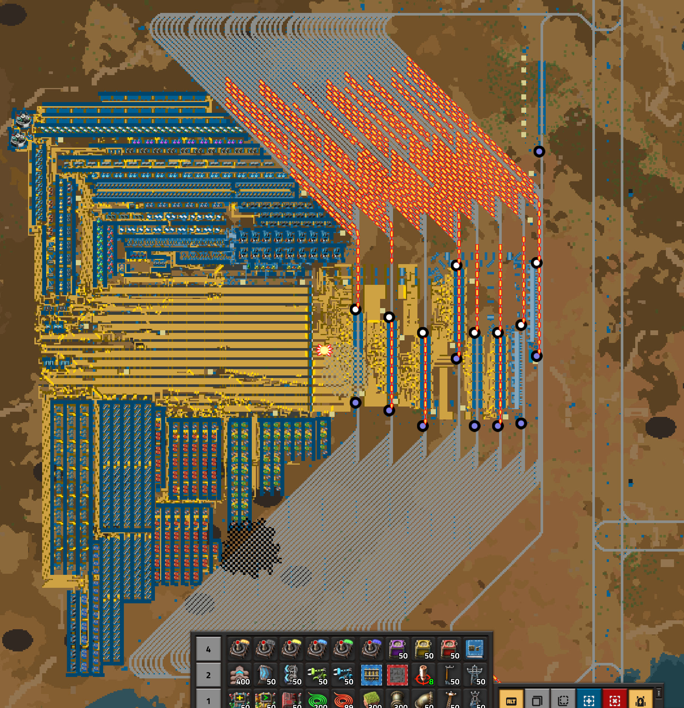
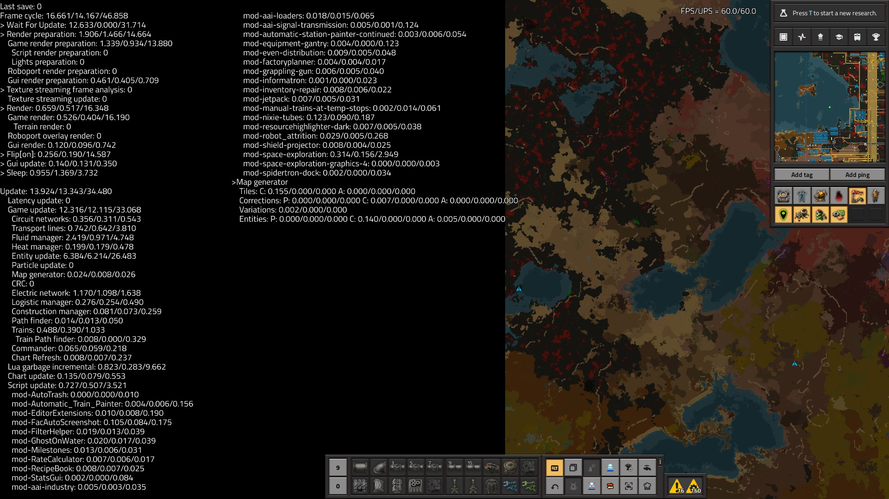
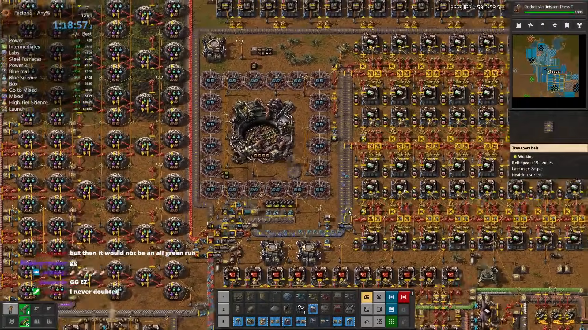

{/* _class: impact */}

# Factorio: Engineering Addiction

Week 11 — Megabase Economics

---

## Megabases and travel time

A megabase isn't just a bigger base — distance itself becomes a cost, and
the layout has to be chosen to pay that cost as little as possible.

- station throughput isn't the same as train capacity on paper: loading,
  unloading, travel and recovery time all eat into how much a route
  actually moves per hour
- a hub-and-spoke layout (small outposts feeding a few concentration hubs,
  which run fewer, larger trains to the main base) cuts congestion at the
  receiving end compared to every outpost running its own train in
- a grid-shaped rail network is easy to expand outward, but rarely gives
  the shortest path between two points — expandability and travel time
  pull in different directions

---

## Two megabase philosophies

Past a certain scale, almost every megabase lands on one of two shapes,
and both lean on trains for the same underlying reason.

- a **sprawl** design keeps a small number of large, centralised hubs and
  relies on trains to haul materials in from spread-out outposts — the
  hubs are big because consolidating production is what makes delivery
  tractable
- a **city block** design instead tiles many small, self-contained blocks
  on a shared rail grid — expansion is "stamp down another block," not
  "grow an existing hub"
- both use trains, not belts, between distant points: an inserter pulling
  off a belt costs more per tick than one pulling from a chest or wagon,
  and a bus spanning megabase distances pays that cost the whole way — a
  train's cost stays roughly constant regardless of distance

---

## Two megabase philosophies, in practice



*Source: Factorio Wiki, CC BY-NC-SA 3.0.*

The sprawl shape: a handful of large hubs, joined by rail across whatever
distance the terrain put between them.

---

## City blocks, in practice



*Source: Factorio Wiki, CC BY-NC-SA 3.0.*

The city-block shape: the same rail-between-blocks logic as the sprawl,
just with the blocks made uniform and small instead of few and large.

---

## The bus doesn't scale

A bus's ceiling is fixed the moment it's built: belt throughput per tier is
a hard number, not a soft one, and the only lever past that number is
width.

- total throughput (both lanes combined) is capped per belt tier: yellow
  15 items/second, red 30, blue 45 — doubling a bus's capacity always
  means doubling its lane count, a faster belt tier doesn't fix a bus
  that's already on the fastest one
- a train scales differently: one cargo wagon holds 2,000 items of ore or
  4,000 of plate per trip, so adding capacity means adding wagons to the
  same two rails, not more parallel infrastructure for the route's entire
  length
- this is why last slide's trains-over-belts choice isn't stylistic — a
  bus spanning megabase distances pays its full width in belts for the
  whole route; a train pays that cost once, at the wagon, regardless of
  how far the rails run

---

## The bus at megabase scale, in practice



*Source: Factorio Wiki, CC BY-NC-SA 3.0.*

Every one of those parallel lanes is capacity the hub needed just to keep
itself fed — the rails they feed into are how everything past this hub
gets served without repeating that width all over again.

---

## UPS basics

Every Factorio tick has a fixed budget — about 16.667 milliseconds — to
finish every calculation the simulation owes for that tick, and once a
base is big enough, that budget stops being free.

- the game targets 60 updates per second (UPS); if a tick's work runs
  over budget, UPS drops below 60 and the whole simulation slows down,
  not just the slow part
- entity count is usually the largest cost — for assembling machines
  it's machine count that costs UPS, not speed, so fewer faster machines
  simulate cheaper for the same output
- belts, trains, fluid and electric networks are each their own cost
  line, and electric cost scales with network count, not size — one
  stray disconnected pole is its own costly network

---

## UPS basics, in practice



*Source: Factorio Wiki, CC BY-NC-SA 3.0.*

This is what "the simulation is a finite resource" looks like as numbers —
every line here is competing for the same 16.667ms.

---

## Expansion

Growing a factory has a theoretical ceiling: if every belt of plate a base
produces is fed straight back into building more production, output can
roughly double every five to six minutes — but only while there's still
somewhere useful to place the next machine.

- doubling needs both the materials for the next stage and the time to
  place them — a factory with the plates but not the belts, poles or bot
  coverage isn't expanding at the theoretical rate, it's expanding at the
  placement rate
- expansion has a stopping point set by the goal, not momentum: a rocket
  launch needs a specific, finite amount of tech and parts, so growing
  the "factory that builds the factory" past that just spends time owed
  to the goal itself
- the same tension as the megabase travel-time tradeoff, one level up:
  every layout decision buys throughput or buys build time, never both
  for free

---

## Speedrunning

A speedrun optimises for one number — wall-clock time to a rocket launch
— and that target changes which designs count as good, compared to a
base built to run indefinitely.

- a speedrun base is judged on how fast it reaches rocket tech and
  parts, not resource efficiency — overproducing costs time for nothing
- because the run ends, long-term concerns a permanent base solves —
  UPS at scale, sustainable ore, tileable expansion — mostly don't
  apply; it can be wasteful wherever that costs no time
- the core decision is the expansion-versus-goal tradeoff above,
  compressed: how long to grow the factory before switching everything
  toward the rocket

---

## Speedrunning techniques

The tradeoff above plays out as a specific set of habits, all aimed at
the same target: the *player's* travel and setup time, not the factory's
throughput.

- **hand feeding**: loading a machine directly from the inventory
  instead of building belts and inserters to do it
- **buffers**: pre-made intermediates carried in rather than produced
  on-site, so a step never has to wait on its own supply chain
- **memorised blueprints**: most speedrun categories restrict importing
  blueprint strings, so fast, exact placement comes from repetition, not
  a library lookup

---

## Speedrunning, in practice



*Source: Factorio Wiki, CC BY-NC-SA 3.0.*

Every split on this timer is time the run can't get back — hand feeding
and memorised placement exist to keep that number moving.

---

## Designing blueprints for speed

A blueprint can be optimised for two different things — how fast it goes
up, or how much it produces once finished — and a design good at one is
often not good at the other.

- a build-speed blueprint favours fewer, simpler entities a bot can
  place quickly with little wiring to check; a throughput blueprint
  favours whatever machine/module/beacon mix produces most per tile
- fewer, faster machines cost less UPS for the same output than many
  slow ones — a UPS-optimised blueprint and a naive "add more
  assemblers" one can hit the same output at very different sim cost
- neither design is wrong — they solve different problems, which is
  exactly what this week's practical compares

---

{/* _class: quote */}

> A speedrun spends time to save time later. A megabase spends layout to save time forever. Neither one is optimising for "more output" in the abstract — ask what a design is actually paying for before calling it good.

---

## This week's practical

```txt
Goal: given two base designs aimed at different goals, explain the purpose
      of their differences
Test: identify what each design is actually optimising for, then trace
      specific design choices back to that target
Pass: each design's actual optimisation target is correctly identified; at
      least three specific design choices are tied back to that target;
      the comparison doesn't just declare one design "better" overall
```

"Better" only means something once you've said better *at what* — a
speedrun base and a megabase can both be correct designs for their own
goal and wrong designs for the other one.
