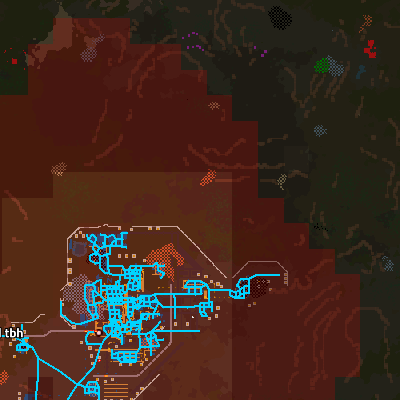
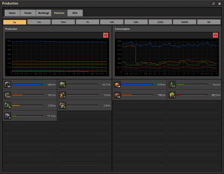
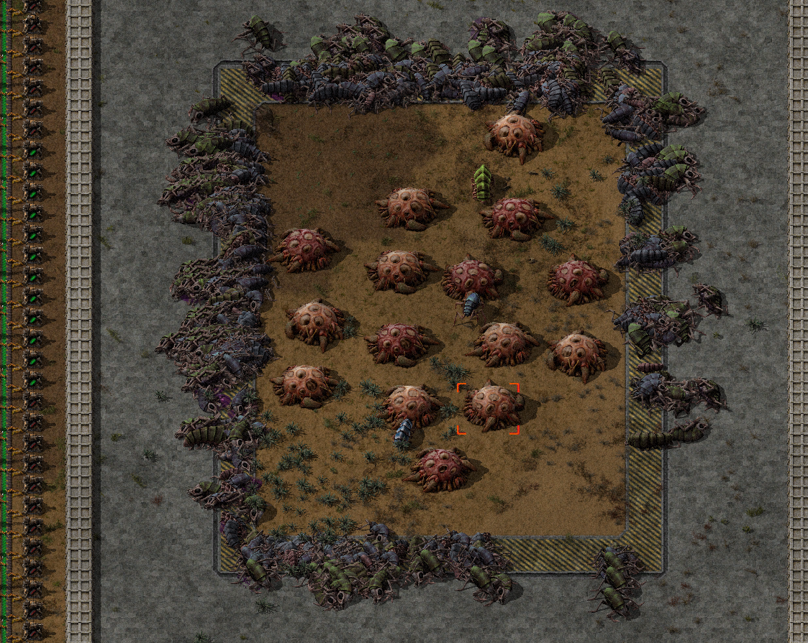

{/* _class: impact */}

# Factorio: Engineering Addiction

Week 12 — The Factory Must Grow

---

## UPS advanced

Week 11 established that UPS is a finite, shared budget. This week's
question is which entities spend that budget fastest — because count
alone doesn't answer it.

- for assembling-machine-type buildings, the number of machines is what
  costs UPS, not their speed — modules and beacons that let fewer,
  faster machines match the same output are a genuine UPS saving, not
  just a space saving
- inserters are a specific, callable-out cost of their own — cutting the
  number of inserters, or clocking them so they don't check every tick,
  reduces this line directly
- biters and spitters sit in their own "Unit" entity class, separate from
  buildings — removing them removes that cost outright, which is why a
  base that's cleared its perimeter runs measurably lighter than one
  still fighting off attacks

---

## Pollution UPS

Pollution isn't free to simulate either — it's a cloud tracked per map
chunk, updated on its own schedule, and it's also what decides how often
biters show up to cost UPS in the first place.

- each 32×32-tile chunk's pollution updates every 64 ticks: once a
  chunk reaches 15.0 pollution it starts spreading outward in all four
  cardinal directions at 2% per 64 ticks, generating new chunks if it
  needs to spread into unexplored map
- a building's actual output isn't its listed base value — it's
  `pollution multiplier × energy-usage multiplier × base pollution`, so
  a heavily module-boosted machine can produce well above its own base
  figure, not just a flat bonus on top of it
---

## Pollution UPS: the biter feedback loop

- pollution doesn't just sit there — spawners absorb it to fuel attacks,
  so a heavier cloud means more frequent, bigger attacks: pollution
  converting straight into last slide's biter-related UPS cost
- cutting pollution output (fewer, more efficient machines) is a UPS
  lever precisely because it starves what spawns the entities costing
  UPS elsewhere

---

## Pollution by building

Count and type both mattered for machines two slides ago; pollution is
the same story with different numbers, and one genuinely counter-
intuitive result: a faster machine tier is not always the dirtier one.

| Building | Pollution/min |
|---|---|
| Boiler | 30 (highest in the base game) |
| Burner mining drill | 12 |
| Electric mining drill / pumpjack | 10 |
| Oil refinery | 6 |
| Chemical plant / centrifuge | 4 |

---

## Pollution by building: assemblers and furnaces

| Building | Pollution/min |
|---|---|
| Assembling machine 1 | 4 |
| Assembling machine 2 | 3 |
| Assembling machine 3 | 2 |
| Steel furnace | 4 |
| Electric furnace | 1 |

Assembling machine 1 → 2 → 3 gets *cleaner* per machine as it gets
faster — the same "fewer, faster machines" move that saves UPS on the
entity-count side also cuts pollution on this side, for the same
underlying reason: fewer machines running the multiplier formula above.

---

## Pollution UPS, in practice



*Source: Factorio Wiki, CC BY-NC-SA 3.0.*

Those hard edges are the chunk boundaries the simulation actually updates
along — the cloud isn't smooth because the underlying calculation isn't
either.

---

## Pollution, in practice



*Source: Factorio Wiki, CC BY-NC-SA 3.0.*

This is the per-building table two slides ago, live — the same
breakdown, read off a running base instead of memorised.

---

## What a cloud actually buys the biters

A spawner doesn't launch an attack because pollution exists — it
launches once it's absorbed enough to afford one, on a schedule with
real numbers behind it, not "eventually."

- every 64 ticks, a spawner in a chunk above 20 pollution absorbs
  `20 + 0.01 × chunk pollution`; below that threshold it absorbs three
  times the cost of the most expensive unit it could currently spawn
  instead — either way, it keeps absorbing until it's banked enough to
  afford one
- an attack wave costs pollution per unit added: 4/20/80/400 for small/
  medium/big/behemoth biter, 4/12/30/200 for the spitter line — a
  heavier cloud doesn't just trigger attacks sooner, it buys a bigger
  wave per trigger
---

## From banked pollution to an attack

- once enough is banked, the spawner sends a unit to a rendezvous point;
  every 1-10 minutes (randomised) the mustered group launches, waiting
  up to 2 more minutes for stragglers still en route
- this is the mechanism behind "heavier cloud, bigger attacks" from the
  Pollution UPS slide earlier, not just a qualitative link — the same
  pollution that costs UPS to simulate is the exact currency spawners
  spend to cost more UPS later

---

## Tile absorption

Chunks absorb pollution passively, at a rate set entirely by what's
covering the ground — not something a player action changes.

| Tile | Pollution/chunk/min |
|---|---|
| Water | -1.536 (fastest) |
| Grass, dirt | -1.106 |
| Red desert, sand | -0.922 |
| Paved tiles (concrete, stone brick), landfill | 0 |

Paving over ground for belts and floors is a UPS-neutral choice on its
own, but it's also a pollution-absorption choice — a base paved edge to
edge is absorbing nothing at the perimeter where absorption would
otherwise matter most.

---

## Pollution sinks

Destroying a nest bumps evolution permanently (Week 5); leaving pollution
alone lets it keep spreading. A pollution sink is a third option: wall off
a cluster of nests, close enough that your own pollution keeps them
docile without destroying them.

- this isn't about pathfinding cost — the UPS bill for biters comes from
  the "Unit" class actually moving and fighting, not from sitting idle.
  A contained cluster that never joins an attack stays idle, so it never
  enters that cost line
- the trade-off is real estate and risk: the sink sits inside territory
  fenced off permanently, and a wall failure releases every contained
  nest at once
- a deliberate alternative to clearing everything (pays evolution) and
  ignoring everything (pays ever-growing attack size), at the cost of
  babysitting one more piece of infrastructure

---

## Pollution sinks, in practice



*Source: Factorio Wiki, CC BY-NC-SA 3.0.*

Every nest inside that wall is still there — it's contained, not cleared,
which is exactly the point: no evolution paid, no attacks launched.

---

## Reducing base footprint

Week 2 framed footprint as a build-time and travel-time question. Run the
same trade-off through a UPS lens and the answer doesn't automatically
match — a smaller footprint isn't always a lighter one.

- footprint and entity count are related but not the same: a compact base
  of many small machines can hold more UPS-costing entities than a
  sprawling one built from fewer, larger ones
- beacons and modules that shrink a line's footprint do so by cutting
  machine count for the same output — the same move that cuts UPS cost,
  so here both axes point the same way
- a smaller pollution footprint also means a smaller cloud, feeding back
  into fewer biter attacks — footprint, pollution and UPS are one
  concern viewed three ways

---

## What causes lower UPS

Diagnosing a slow base means picking the right cause off this week's
checklist, not naming "too much stuff" — each candidate calls for a
different fix.

- **entity count**: raw numbers — more machines, inserters and belts
  each add their own small cost; the fix is usually consolidation
- **entity type**: the same count of a cheaper entity type costs less
  than an expensive one — fewer, faster assemblers beat many slow ones
- **pollution and biter activity**: scales with output and spread, not
  base size — the fix is pollution reduction or a cleared perimeter
- clearing biters doesn't help an entity-count problem, and
  consolidating machines doesn't help a pollution problem

---

{/* _class: quote */}

> A slow base isn't one problem wearing different masks. Entity count, entity type, and pollution are three different bills, and paying down the wrong one leaves the slowdown exactly where it was.

---

## This week's practical

```txt
Goal: audit a supplied base's UPS optimisation and remaining cost
Test: check it against this week's checklist — entity count, entity
      type, pollution and biter activity
Pass: optimisations correctly identified; remaining cost correctly
      attributed; a UPS problem is distinguished from a ratio problem
```

A production-ratio problem that looks like lag, and a UPS problem that
looks like a bottleneck, are the two mistakes this course has spent
twelve weeks teaching you to tell apart.
